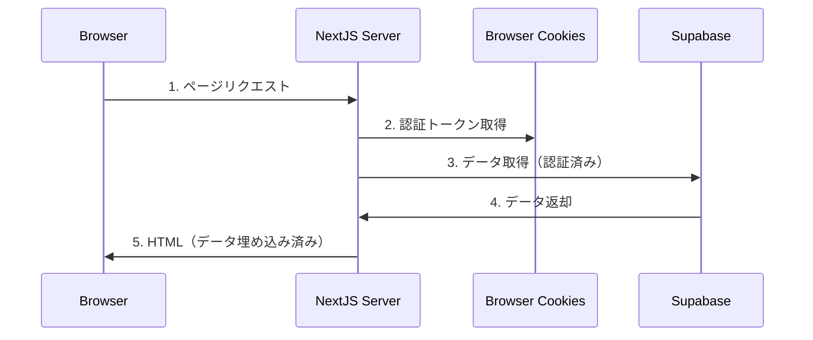
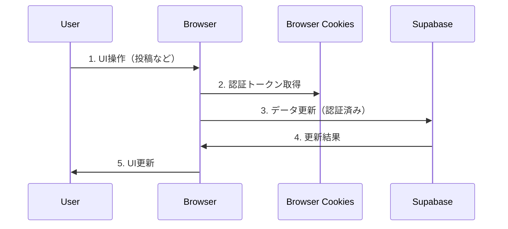
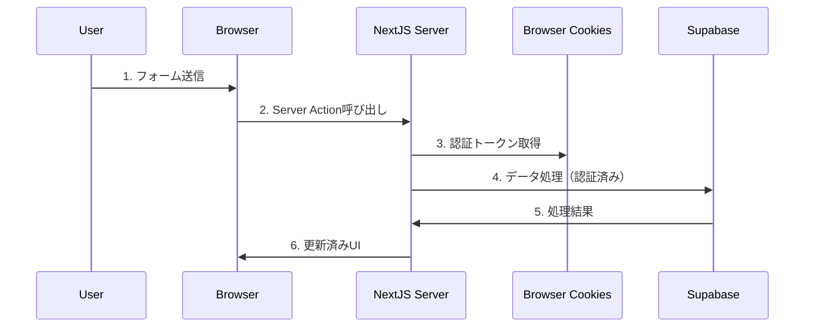

# カタマリ 認証フロー詳細設計書

## 1. 認証アーキテクチャ概要

カタマリプラットフォームでは、Next.js App RouterとSupabase Authを組み合わせたハイブリッド認証アーキテクチャを採用しています。このアプローチにより、サーバーサイドレンダリングの利点（SEO、初期ロード速度）とクライアントサイドの柔軟性を両立させています。

### 1.1 アーキテクチャ図

```
┌────────────────────────────────┐                ┌─────────────────────┐
│         クライアント        　   │                │       サーバー       │
│  ┌────────────────────────┐    │                │                     │
│  │      ブラウザ           │    │                │  ┌───────────────┐  │
│  │  ┌────────────────┐    │    │                │  │   Next.js     │  │
│  │  │    Cookies     │    │    │                │  │               │  │
│  │  │ ┌────────────┐ │    │    │                │  │ ┌───────────┐ │  │
│  │  │ │ Supabase   │ │    │    │                │  │ │サーバー    │ │  │
│  │  │ │ Auth Token │ │<───┼────┼────────────────┼──┼─│コンポーネント│ │  │
│  │  │ └────────────┘ │    │    │                │  │ │           │ │  │
│  │  └────────────────┘    │    │                │  │ └───────────┘ │  │
│  │                        │    │                │  │               │  │
│  │  ┌────────────────┐    │    │                │  └───┬───────────┘  │
│  │  │  クライアント    │    │    │                │      │               │
│  │  │  コンポーネント  │    │    │                │      │               │
│  │  │                │    │    │                │      │               │
│  │  └────────┬───────┘    │    │                │      │               │
│  └───────────┼────────────┘    │                └──────┼───────────────┘
│              │                 │                       │                
└──────────────┼─────────────────┘                       │                
               │                                         │                
               │                                         │                
               │         ┌──────────────────────┐        │                
               │         │                      │        │                
               └────────>│     Supabase         │<───────┘                
                         │                      │                         
                         └──────────────────────┘                         
```

### 1.2 使用する主要なコンポーネント

- **Next.js App Router**: ページレンダリングとルーティングを担当
- **Supabase Auth**: 認証機能を提供
- **Cookie**: 認証トークンの保存に使用

## 2. 認証フロー詳細

### 2.1 ログインフロー

```
┌───────────────┐      ┌───────────────┐      ┌───────────────┐
│               │      │               │      │               │
│   Browser     │ ──→  │   Supabase    │ ──→  │    Cookie     │
│   (Login)     │      │     Auth      │      │   Storage     │
│               │      │               │      │               │
└───────────────┘      └───────────────┘      └───────────────┘
```

1. ユーザーが`/login`ページにアクセスし、「Googleでログイン」ボタンをクリック
2. Supabase Auth APIが起動し、Googleの認証ページにリダイレクト
3. ユーザーがGoogleでログイン認証を完了
4. Googleが認証コードをリダイレクトURLに返す
5. Supabaseがこのコードを使ってアクセストークンと更新トークンを取得
6. トークンがCookieに保存される（`sb-xxx-auth-token`）
7. ユーザーはサイトにリダイレクトされる（通常はホームページ）

### 2.2 サーバーサイドレンダリングでの認証情報利用

```
┌───────────────┐      ┌───────────────┐      ┌───────────────┐
│               │      │               │      │               │
│    Cookie     │ ──→  │  Server       │ ──→  │   Supabase    │
│    Storage    │      │  Component    │      │     API       │
│               │      │               │      │               │
└───────────────┘      └───────────────┘      └───────────────┘
```

1. ユーザーがページにアクセス（例: `/articles`）
2. Next.jsサーバーがリクエストを処理
3. サーバーコンポーネントが実行され、`cookies()`関数を使ってCookieにアクセス
4. `createServerComponentClient({ cookies })`でSupabaseクライアントを初期化
5. 初期化されたクライアントが認証トークンを使用してSupabase APIにリクエスト
6. データが取得され、サーバーでHTMLがレンダリングされる
7. 完全にレンダリングされたHTMLがクライアントに送信される

### 2.3 クライアントサイドでの認証情報利用

```
┌───────────────┐      ┌───────────────┐      ┌───────────────┐
│               │      │               │      │               │
│    Cookie     │ ──→  │    Client     │ ──→  │   Supabase    │
│    Storage    │      │  Component    │      │     API       │
│               │      │               │      │               │
└───────────────┘      └───────────────┘      └───────────────┘
```

1. 'use client'ディレクティブが付与されたコンポーネントがブラウザで実行される
2. コンポーネント内で`createClientSupabase()`を呼び出す
3. ブラウザのCookieから認証トークンを取得
4. 認証済みの状態でSupabase APIにアクセス
5. データの取得・更新などの操作が実行される
6. UIが更新される

## 3. データアクセスパターン

### 3.1 初期ページロード（サーバーサイド）



- **ユースケース**: 記事一覧ページ、記事詳細ページなど
- **利点**: 高速な初期ページロード、SEO最適化、データのプリフェッチ
- **実装例**: `app/articles/page.tsx`, `app/articles/[id]/page.tsx`

### 3.2 クライアント操作（クライアントサイド）



- **ユースケース**: 新規記事作成、プロフィール編集など
- **利点**: インタラクティブなUI、ページリロードなしの操作
- **実装例**: `app/articles/new/page.tsx`, `app/profile/page.tsx`

### 3.3 Server Actions（ハイブリッド）



- **ユースケース**: ビューカウント増加、ファイルダウンロードなど
- **利点**: セキュアな処理、データ検証、インタラクティブなUI
- **実装例**: `incrementViewCount`関数（`app/articles/[id]/page.tsx`内）

## 4. 認証関連のコード実装

### 4.1 サーバーコンポーネントでの実装

```typescript
import { createServerComponentClient } from '@supabase/auth-helpers-nextjs';
import { cookies } from 'next/headers';

export default async function Page() {
  const supabase = createServerComponentClient({ cookies });
  
  // データの取得
  const { data, error } = await supabase
    .from('articles')
    .select('*');
    
  // ...
}
```

### 4.2 クライアントコンポーネントでの実装

```typescript
'use client';

import { useState, useEffect } from 'react';
import { createClientSupabase } from '@/lib/supabase-client';

export default function Component() {
  const [user, setUser] = useState(null);
  
  useEffect(() => {
    const checkAuth = async () => {
      const supabase = createClientSupabase();
      const { data: { user } } = await supabase.auth.getUser();
      setUser(user);
    };
    
    checkAuth();
  }, []);
  
  // ...
}
```

### 4.3 認証ヘルパー関数

```typescript
// lib/supabase-client.ts
import { createClientComponentClient } from '@supabase/auth-helpers-nextjs';

export const createClientSupabase = () => {
  return createClientComponentClient();
};
```

## 5. セキュリティ考慮事項

### 5.1 Cookieセキュリティ

- Supabaseが生成するCookieはデフォルトで以下の属性が設定されています:
  - **HttpOnly**: JavaScript経由のCookieアクセスを防止
  - **Secure**: HTTPS接続でのみCookieが送信される
  - **SameSite=Lax**: クロスサイトリクエストでのCookie送信を制限

### 5.2 認証状態の検証

- サーバーサイドでのリクエスト処理時に認証状態を検証
- 非認証ユーザーからの保護されたリソースへのアクセスを制限
- ミドルウェアによるルートベースの認証保護

### 5.3 RLS (Row Level Security)

- SupabaseのRLSポリシーによるデータベースレベルでのアクセス制御
- ユーザーは自分のデータのみにアクセス可能
- 公開リソースは明示的に定義されたポリシーに基づいてアクセス可能

## 6. トラブルシューティング

### 6.1 一般的な問題

- **認証状態の不一致**: サーバーとクライアント間で認証状態が同期されない
- **トークン期限切れ**: 認証トークンの有効期限が切れる
- **CORS問題**: クロスオリジンリクエストに関する問題

### 6.2 解決策

- **認証状態の不一致**: `createServerComponentClient`と`createClientSupabase`の一貫した使用
- **トークン期限切れ**: Supabaseの自動トークンリフレッシュ機能を活用
- **CORS問題**: Supabaseプロジェクト設定でCORSを適切に設定 