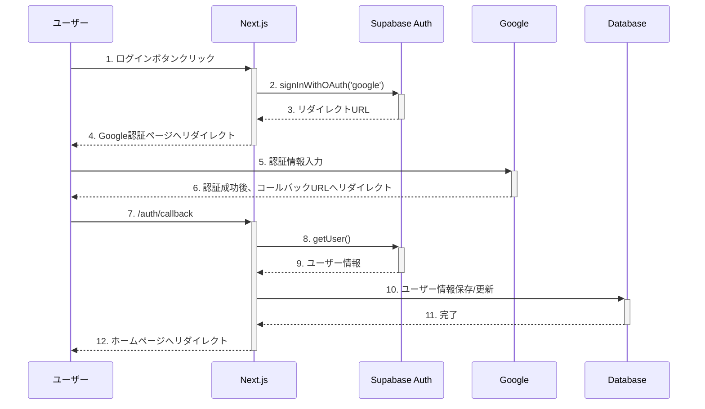

# セキュリティ詳細設計書

## 1. 認証・認可

### 1.1 認証システム概要

「カタマリ」では、Supabase Authenticationを利用して認証機能を実装しています。主な認証方式は以下の通りです：

- **Google OAuth 2.0**: プライマリ認証方式として採用
- **セッション管理**: JWT（JSON Web Token）によるステートレスセッション
- **認証状態の永続化**: クッキーベースのセッション維持

### 1.2 認証フロー詳細

#### 1.2.1 Google OAuth認証フロー



#### 1.2.2 実装コード

```typescript
// lib/supabase/auth.ts
import { supabase } from './client';

// Google認証
export async function signInWithGoogle() {
  const { data, error } = await supabase.auth.signInWithOAuth({
    provider: 'google',
    options: {
      redirectTo: `${window.location.origin}/auth/callback`,
    },
  });
  
  return { data, error };
}

// サインアウト
export async function signOut() {
  const { error } = await supabase.auth.signOut();
  return { error };
}

// セッション取得
export async function getSession() {
  const { data, error } = await supabase.auth.getSession();
  return { session: data.session, error };
}
```

#### 1.2.3 ユーザー自動登録と email 処理

ユーザー認証後、Supabaseのトリガー機能を使って自動的に`public.users`テーブルにユーザー情報を登録します。このトリガーにより、Googleアカウントのメールアドレスが適切に取得され、データベースに保存されます。

```sql
-- 認証トリガー関数
CREATE OR REPLACE FUNCTION public.handle_new_user() 
RETURNS trigger AS $$
BEGIN
  INSERT INTO public.users (id, email, name, avatar_url)
  VALUES (
    NEW.id, 
    NEW.email,
    COALESCE(NEW.raw_user_meta_data->>'full_name', split_part(NEW.email, '@', 1), 'User'),
    NEW.raw_user_meta_data->>'avatar_url'
  )
  ON CONFLICT (id) DO UPDATE
  SET 
    email = EXCLUDED.email,
    name = EXCLUDED.name,
    avatar_url = EXCLUDED.avatar_url,
    updated_at = now();
    
  RETURN NEW;
END;
$$ LANGUAGE plpgsql SECURITY DEFINER;

-- 認証トリガーの設定
CREATE TRIGGER on_auth_user_created
  AFTER INSERT ON auth.users
  FOR EACH ROW EXECUTE FUNCTION public.handle_new_user();
```

このトリガーは以下の処理を行います：

1. Google認証が成功すると、`auth.users`テーブルに新しいレコードが作成されます
2. その後、トリガーが発火し、`public.users`テーブルに対応するユーザーレコードを自動作成します
3. メールアドレスはGoogleアカウントから自動的に取得されます
4. 名前はGoogleのフルネーム、またはそれがない場合はメールアドレスのユーザー部分を使用します
5. 既存ユーザーの場合は、情報が更新されます

このトリガーにより、フロントエンドからユーザー登録のためのフォーム入力が不要になり、スムーズなオンボーディング体験を提供しています。また、メールアドレスは以下の目的で利用されます：

- ユーザーの一意識別子としての利用
- 将来的な通知機能のための連絡先情報
- 同一ユーザーの重複登録防止

メールアドレスの扱いに関するセキュリティ対策：

- メールアドレスへのアクセスはRLSポリシーで制限
- フロントエンドでのメールアドレス表示は限定的
- ユーザープロフィールでは表示名（name）のみを表示

### 1.3 認証情報の保護

- **JWT有効期限**: 24時間（デフォルト設定）
- **リフレッシュトークン有効期限**: 7日間
- **トークン保存方法**: HTTPOnly Cookieでの保存（XSS対策）
- **セキュアな通信**: HTTPS通信の強制

### 1.4 認可ポリシー（RLS）

#### 1.4.1 usersテーブルのRLSポリシー

```sql
-- 読み取りポリシー（全ユーザー情報は公開）
CREATE POLICY "ユーザー情報は全体に公開" ON users
  FOR SELECT USING (true);

-- 挿入ポリシー（自分のプロフィールのみ作成可能）
CREATE POLICY "自分のプロフィールのみ作成可能" ON users
  FOR INSERT WITH CHECK (auth.uid() = id);

-- 更新ポリシー（自分のプロフィールのみ更新可能）
CREATE POLICY "自分のプロフィールのみ更新可能" ON users
  FOR UPDATE USING (auth.uid() = id);

-- 削除ポリシー（自分のプロフィールのみ削除可能）
CREATE POLICY "自分のプロフィールのみ削除可能" ON users
  FOR DELETE USING (auth.uid() = id);
```

#### 1.4.2 articlesテーブルのRLSポリシー

```sql
-- 読み取りポリシー（公開状態の記事は誰でも閲覧可能）
CREATE POLICY "記事は全体に公開" ON articles
    FOR SELECT USING (status = 'published' OR auth.uid() = author_id);

-- 挿入ポリシー（認証済みユーザーのみ記事作成可能）
CREATE POLICY "Users can insert their own articles" ON articles
    FOR INSERT WITH CHECK (auth.uid() = author_id);

-- 更新ポリシー（自分の記事のみ更新可能）
CREATE POLICY "自分の記事のみ更新可能" ON articles
    FOR UPDATE USING (auth.uid() = author_id);

-- 削除ポリシー（自分の記事のみ削除可能）
CREATE POLICY "自分の記事のみ削除可能" ON articles
    FOR DELETE USING (auth.uid() = author_id);
```

#### 1.4.3 ストレージRLSポリシー

```sql
-- ストレージの読み取りポリシー（公開読み取り）
CREATE POLICY "公開ファイルの読み取りポリシー" ON storage.objects
    FOR SELECT USING (bucket_id = 'articles' OR bucket_id = 'thumbnails' OR bucket_id = 'media' OR bucket_id = 'avatars');
```

#### 1.5 URL保護の実装

以下のような保護されたルートへのアクセスを認証チェックで制限します：

```javascript
const protectedRoutes = ['/profile', '/upload', '/articles/edit'];

export default function authMiddleware(req: NextRequest) {
  const pathname = req.nextUrl.pathname;
  
  // 保護されたルートかチェック
  if (protectedRoutes.some(route => pathname.startsWith(route))) {
    // Cookieからセッション情報を取得
    const session = getSessionFromCookie(req);
    
    // セッションがない場合はログインページにリダイレクト
    if (!session) {
      const url = new URL('/login', req.url);
      url.searchParams.set('redirect', pathname);
      return NextResponse.redirect(url);
    }
  }
  
  return NextResponse.next();
}
```

##### 1.3.7 記事-タグ関連テーブル (article_tags)

タグ付け機能のためのセキュリティポリシーも実装しています：

```sql
-- タグ付けポリシー（記事所有者のみがタグを関連付けできる）
CREATE POLICY "記事所有者のみがタグを関連付けできる" ON article_tags
    FOR INSERT WITH CHECK (
        EXISTS (
            SELECT 1 FROM articles
            WHERE articles.id = article_id
            AND articles.author_id = auth.uid()
        )
    );

-- タグ削除ポリシー（記事所有者のみが関連タグを削除できる）
CREATE POLICY "記事所有者のみが関連タグを削除できる" ON article_tags
    FOR DELETE USING (
        EXISTS (
            SELECT 1 FROM articles
            WHERE articles.id = article_id
            AND articles.author_id = auth.uid()
        )
    );

-- タグ閲覧ポリシー（すべてのユーザーがタグ関連を閲覧できる）
CREATE POLICY "すべてのユーザーが記事-タグ関連を閲覧できる" ON article_tags
    FOR SELECT USING (true);
```

function validateFavoriteRequest(articleId: string): { isValid: boolean; error?: string } {
  if (!articleId || typeof articleId !== 'string' || articleId.trim() === '') {
    return { isValid: false, error: 'Article ID is required' };
  }
  
  return { isValid: true };
}

function validateShareRequest(
  articleId: string,
  platform: string
): { isValid: boolean; error?: string } {
  if (!articleId || typeof articleId !== 'string' || articleId.trim() === '') {
    return { isValid: false, error: 'Article ID is required' };
  }
  
  if (!platform || typeof platform !== 'string' || !['twitter', 'facebook', 'linkedin'].includes(platform)) {
    return { isValid: false, error: 'Valid platform is required' };
  }
  
  return { isValid: true };
}

function validateDownloadRequest(
  articleId: string,
  fileType?: string
): { isValid: boolean; error?: string } {
  if (!articleId || typeof articleId !== 'string' || articleId.trim() === '') {
    return { isValid: false, error: 'Article ID is required' };
  }
  
  // ファイルタイプが指定されている場合は検証
  if (fileType && typeof fileType === 'string') {
    const allowedTypes = ['stl', 'obj', 'gltf', 'glb', 'zip'];
    if (!allowedTypes.includes(fileType.toLowerCase())) {
      return { isValid: false, error: 'Invalid file type' };
    }
  }
  
  return { isValid: true };
}

export function generateShareUrl(platform: string, articleId: string, articleTitle: string): string {
  // タイトルをURLセーフにする
  const safeTitle = encodeURIComponent(
    articleTitle.replace(/[^\w\s\u3040-\u309F\u30A0-\u30FF\u4E00-\u9FAF]/g, '')
  );
  
  const baseUrl = `${window.location.origin}/articles/${articleId}`;
  
  // プラットフォームごとのシェアURL生成
  switch (platform) {
    case 'twitter':
      return `https://twitter.com/intent/tweet?url=${encodeURIComponent(baseUrl)}&text=${safeTitle}`;
    case 'facebook':
      return `https://www.facebook.com/sharer/sharer.php?u=${encodeURIComponent(baseUrl)}`;
    case 'line':
      return `https://social-plugins.line.me/lineit/share?url=${encodeURIComponent(baseUrl)}`;
    default:
      return baseUrl;
  }
}

export async function shareArticle(articleId: string, platform: string, articleTitle: string) {
  try {
    // シェアURLの生成
    const shareUrl = generateShareUrl(platform, articleId, articleTitle);
    
    // シェアURLを新しいウィンドウで開く
    window.open(shareUrl, '_blank');
    
    // シェア情報をサーバーに記録
    await fetch('/api/shares', {
      method: 'POST',
      headers: {
        'Content-Type': 'application/json',
      },
      body: JSON.stringify({
        articleId,
        platform,
      }),
    });
    
    return { success: true };
  } catch (error) {
    console.error('Share error:', error);
    return { success: false, error };
  }
}

## 2. データセキュリティ

### 2.1 データベースセキュリティ

- **SSL接続**: PostgreSQLへの接続は暗号化されています
- **パラメータ化クエリ**: SQLインジェクション対策として、すべてのクエリはパラメータ化されています
- **最小権限の原則**: アプリケーションユーザーには必要最小限の権限のみを付与
- **データの暗号化**: 機密データは保存時に暗号化

### 2.2 ストレージセキュリティ

- **アクセス制御**: RLSによる厳格なアクセス制御
- **ファイル検証**: アップロード前に形式とサイズを検証
- **安全なファイル名**: ランダムなUUIDを使用してファイル名を生成
- **アップロード上限**: ファイルサイズの上限を設定（モデルファイル: 50MB、サムネイル: 5MB）

### 2.3 環境変数の保護

- **環境変数の分離**: 開発・ステージング・本番環境の分離
- **シークレット管理**: 機密情報は環境変数として保存
- **クライアント側の制限**: クライアント側からアクセスできる環境変数は限定的

```typescript
// 環境変数例
// .env.local
NEXT_PUBLIC_SUPABASE_URL=https://xxxxxxxxxxxxxxxxxxxx.supabase.co
NEXT_PUBLIC_SUPABASE_ANON_KEY=eyJhbGciOiJIUzI1NiIsInR5cCI6IkpXVCJ9...
SUPABASE_SERVICE_ROLE_KEY=eyJhbGciOiJIUzI1NiIsInR5cCI6IkpXVCJ9... // クライアント側からはアクセス不可
```

### 2.4 フェーズ2で追加される新機能のデータ検証

#### 2.4.1 お気に入り機能のデータ検証

```typescript
// お気に入り登録時の入力検証
export function validateFavoriteRequest(modelId: string): { isValid: boolean; error?: string } {
  if (!modelId || typeof modelId !== 'string' || modelId.trim() === '') {
    return { isValid: false, error: 'モデルIDが無効です' };
  }
  
  return { isValid: true };
}
```

#### 2.4.2 共有情報の検証

```typescript
// 共有情報登録時の入力検証
export function validateShareRequest(
  modelId: string, 
  platform: string,
  shareUrl?: string
): { isValid: boolean; error?: string } {
  if (!modelId || typeof modelId !== 'string' || modelId.trim() === '') {
    return { isValid: false, error: 'モデルIDが無効です' };
  }
  
  const validPlatforms = ['twitter', 'facebook', 'line', 'other'];
  if (!platform || !validPlatforms.includes(platform.toLowerCase())) {
    return { isValid: false, error: 'プラットフォームが無効です' };
  }
  
  if (shareUrl && typeof shareUrl === 'string') {
    try {
      // URLの基本的な検証
      new URL(shareUrl);
    } catch (e) {
      return { isValid: false, error: '共有URLが無効です' };
    }
  }
  
  return { isValid: true };
}
```

#### 2.4.3 タグの検証

```typescript
// タグ名の検証
export function validateTagName(tagName: string): { isValid: boolean; error?: string } {
  if (!tagName || typeof tagName !== 'string' || tagName.trim() === '') {
    return { isValid: false, error: 'タグ名が無効です' };
  }
  
  if (tagName.length > 20) {
    return { isValid: false, error: 'タグ名は20文字以内である必要があります' };
  }
  
  // 特殊文字やHTMLタグの排除
  const sanitizedTag = tagName
    .trim()
    .replace(/<[^>]*>/g, '')
    .replace(/[^\w\s\u3040-\u309F\u30A0-\u30FF\u4E00-\u9FAF]/g, '');
  
  if (sanitizedTag !== tagName.trim()) {
    return { isValid: false, error: 'タグ名に無効な文字が含まれています' };
  }
  
  return { isValid: true };
}

// モデルへのタグ追加リクエストの検証
export function validateAddTagsRequest(
  modelId: string,
  tags: string[]
): { isValid: boolean; error?: string } {
  if (!modelId || typeof modelId !== 'string' || modelId.trim() === '') {
    return { isValid: false, error: 'モデルIDが無効です' };
  }
  
  if (!Array.isArray(tags)) {
    return { isValid: false, error: 'タグは配列で指定してください' };
  }
  
  if (tags.length === 0) {
    return { isValid: false, error: '少なくとも1つのタグを指定してください' };
  }
  
  if (tags.length > 5) {
    return { isValid: false, error: 'タグは最大5つまで指定できます' };
  }
  
  for (const tag of tags) {
    const validation = validateTagName(tag);
    if (!validation.isValid) {
      return validation;
    }
  }
  
  return { isValid: true };
}
```

## 3. フロントエンドセキュリティ

### 3.1 XSS（クロスサイトスクリプティング）対策

- **React DOMエスケープ**: Reactの自動エスケープ機能の活用
- **Content Security Policy (CSP)**: スクリプト、スタイル、その他リソースの実行制限
- **HTTPOnly Cookie**: 認証情報の保護
- **dangerouslySetInnerHTML の回避**: ユーザー入力のHTML挿入を回避

### 3.2 CSRF（クロスサイトリクエストフォージェリ）対策

- **SameSite Cookie**: Cookieの送信を同一サイトに制限
- **CSRF トークン**: 状態変更操作に対するトークン検証
- **Referrer Policy**: 機密情報を含むURLの漏洩防止

### 3.3 セキュアなフォーム実装

- **フォームバリデーション**: クライアント側とサーバー側の両方でバリデーション
- **レート制限**: フォーム送信の頻度を制限
- **CAPTCHA**: 自動化された攻撃の防止

### 3.4 セキュアなAPIリクエスト

```typescript
// apiClient.ts
import axios from 'axios';

const apiClient = axios.create({
  baseURL: '/api',
  headers: {
    'Content-Type': 'application/json',
  },
  // CSRFトークンの自動添付（Next.jsでの設定による）
  withCredentials: true,
});

// レスポンスインターセプタでのエラーハンドリング
apiClient.interceptors.response.use(
  (response) => response,
  (error) => {
    // 認証エラー
    if (error.response?.status === 401) {
      // 認証ページへリダイレクト
      window.location.href = '/auth/signin';
    }
    
    // その他のエラー
    return Promise.reject(error);
  }
);

export default apiClient;
```

### 3.5 フェーズ2で追加される新機能のフロントエンドセキュリティ

#### 3.5.1 SNS共有機能

```typescript
// ユーザー入力が不要な安全なシェアURLの生成
export function generateShareUrl(platform: string, modelId: string, modelTitle: string): string {
  // URLに使用するモデルタイトルのサニタイズと短縮
  const sanitizedTitle = encodeURIComponent(
    modelTitle.replace(/[^\w\s\u3040-\u309F\u30A0-\u30FF\u4E00-\u9FAF]/g, '')
  ).slice(0, 30);
  
  const baseUrl = `${window.location.origin}/models/${modelId}`;
  
  switch (platform.toLowerCase()) {
    case 'twitter':
      return `https://twitter.com/intent/tweet?url=${encodeURIComponent(baseUrl)}&text=${sanitizedTitle}%20-%20カタマリ`;
    case 'facebook':
      return `https://www.facebook.com/sharer/sharer.php?u=${encodeURIComponent(baseUrl)}`;
    case 'line':
      return `https://social-plugins.line.me/lineit/share?url=${encodeURIComponent(baseUrl)}`;
    default:
      return baseUrl;
  }
}

// 安全なシェア処理
export async function shareModel(modelId: string, platform: string, modelTitle: string) {
  try {
    // 安全なURLを生成
    const shareUrl = generateShareUrl(platform, modelId, modelTitle);
    
    // 新しいウィンドウでシェアダイアログを開く（ポップアップブロッカーに注意）
    const width = 600;
    const height = 400;
    const left = (window.innerWidth - width) / 2;
    const top = (window.innerHeight - height) / 2;
    
    window.open(
      shareUrl,
      `share_${platform}`,
      `width=${width},height=${height},left=${left},top=${top}`
    );
    
    // 共有情報を記録
    await fetch('/api/shares', {
      method: 'POST',
      headers: {
        'Content-Type': 'application/json',
      },
      body: JSON.stringify({
        modelId,
        platform,
        shareUrl,
      }),
    });
    
    return true;
  } catch (error) {
    console.error('共有エラー:', error);
    return false;
  }
}
```

#### 3.5.2 タグ処理のセキュリティ

```typescript
// タグ入力のフロントエンド検証と整形
export function sanitizeAndValidateTags(inputTags: string[]): {
  validTags: string[];
  invalidTags: string[];
} {
  const validTags: string[] = [];
  const invalidTags: string[] = [];
  
  // 重複を排除し、空の値をフィルタリング
  const uniqueTags = [...new Set(inputTags.map(tag => tag.trim()).filter(Boolean))];
  
  for (const tag of uniqueTags) {
    // 長さチェック
    if (tag.length > 20) {
      invalidTags.push(tag);
      continue;
    }
    
    // 特殊文字やHTMLタグの排除
    const sanitizedTag = tag
      .replace(/<[^>]*>/g, '')
      .replace(/[^\w\s\u3040-\u309F\u30A0-\u30FF\u4E00-\u9FAF]/g, '');
    
    if (sanitizedTag !== tag) {
      invalidTags.push(tag);
      continue;
    }
    
    validTags.push(sanitizedTag);
  }
  
  // 最大5つまで
  return {
    validTags: validTags.slice(0, 5),
    invalidTags
  };
}
```

## 4. 通信セキュリティ

### 4.1 HTTPS

- 全ての通信はHTTPSで暗号化
- 自動的にHTTPからHTTPSへリダイレクト
- Strict-Transport-Security (HSTS) ヘッダーの設定

### 4.2 APIエンドポイントの保護

- レート制限: APIリクエスト数の制限による過負荷・攻撃の防止
- APIキー管理: クライアント側の.envファイルでキーを管理
- Supabase JWT検証: API認証の自動化

### 4.3 CORS設定

```typescript
// next.config.js
module.exports = {
  async headers() {
    return [
      {
        source: '/api/:path*',
        headers: [
          { key: 'Access-Control-Allow-Credentials', value: 'true' },
          { key: 'Access-Control-Allow-Origin', value: 'https://katawaku.example.com' }, // 本番ドメイン
          { key: 'Access-Control-Allow-Methods', value: 'GET,OPTIONS,PATCH,DELETE,POST,PUT' },
          { key: 'Access-Control-Allow-Headers', value: 'X-CSRF-Token,X-Requested-With,Accept,Accept-Version,Content-Length,Content-MD5,Content-Type,Date,X-Api-Version' },
        ],
      },
    ];
  },
};
```

## 5. セキュリティ監視・評価

### 5.1 セキュリティテスト戦略

- **自動化セキュリティテスト**: CI/CDパイプラインに組み込む
- **ペネトレーションテスト**: 定期的な脆弱性テスト
- **セキュリティコードレビュー**: コードレビュープロセスにセキュリティ観点を組み込む

### 5.2 セキュリティモニタリング

- **ログモニタリング**: 不審なアクティビティの検出
- **レート制限違反の監視**: 潜在的な攻撃の検出
- **アクセスパターン分析**: 異常な行動パターンの検出

### 5.3 フェーズ2で追加される新機能のセキュリティテスト

#### 5.3.1 お気に入り機能のセキュリティテスト項目

1. 未認証ユーザーがお気に入りAPIを呼び出した場合に403エラーを返すこと
2. 認証済みユーザーのみが自分のお気に入りを追加・削除できること
3. お気に入りの数に関する整合性チェック（負の値にならないなど）
4. お気に入りテーブルへの直接アクセスに対するRLSポリシーの有効性検証

#### 5.3.2 共有機能のセキュリティテスト項目

1. 共有URLが適切にサニタイズされていること
2. 共有プラットフォームのバリデーションが機能していること
3. 共有情報のプライバシー保護（ユーザーIDがオプショナルであることの確認）
4. 共有カウントの整合性チェック

#### 5.3.3 タグ機能のセキュリティテスト項目

1. タグ名のサニタイゼーションとバリデーションの有効性
2. タグの最大数制限の機能確認
3. モデル所有者以外がタグを追加できないことの確認
4. タグインジェクション攻撃への耐性確認

## 6. インシデント対応計画

### 6.1 インシデント検出と報告

- セキュリティインシデントの検出方法
- インシデント報告プロセスとテンプレート

### 6.2 インシデント対応手順

- 各種インシデントに対する対応手順
- 責任者と連絡先

### 6.3 リカバリー計画

- データバックアップと復旧手順
- サービス復旧手順

## 7. コンプライアンス対応

### 7.1 個人情報保護

- 個人情報の収集と利用目的の明確化
- データの保持期間
- ユーザーによるデータ削除リクエスト対応

### 7.2 法的要件とポリシー

- プライバシーポリシー
- 利用規約
- クッキーポリシー

## 8. セキュリティ対策強化計画

「カタマリ」のセキュリティを継続的に向上させるため、以下の対策を実施します。

### 8.1 コード全体把握

#### 8.1.1 コードレビュープロセス

セキュリティの観点からコードを把握するため、以下のコードレビュープロセスを導入します。

1. **静的解析ツールの導入**
   - ESLint + セキュリティプラグイン
   - SonarQube
   - CodeQL (GitHub)

2. **コードレビューワークフロー**
   ```
   [開発者] → [プルリクエスト作成] → [静的解析] → [セキュリティレビュー] → [機能レビュー] → [マージ]
   ```

3. **セキュリティレビューチェックリスト**
   - 入力バリデーションの実装
   - SQLインジェクション対策
   - XSS対策
   - CSRF対策
   - 適切な認証・認可の実装
   - 機密情報の適切な管理
   - エラーハンドリングとログ記録

#### 8.1.2 依存関係管理

1. **定期的な脆弱性チェック**
   - npm auditの毎月実行
   - Dependabotアラートの監視

2. **パッチ適用ポリシー**
   - 重大な脆弱性: 即時適用
   - 中程度の脆弱性: 1週間以内に適用
   - 軽微な脆弱性: 次回の定期更新時に適用

3. **依存関係の最小化**
   - 使用していないパッケージの削除
   - 同等機能を持つパッケージの統合
   - 代替手段のある大規模パッケージの置き換え

### 8.2 セキュリティ資料化

#### 8.2.1 脅威モデリング

1. **アーキテクチャ図**
   - コンポーネント間の信頼境界
   - データフロー図
   - 攻撃対象面の特定

2. **脅威モデル**
   - STRIDE分析（なりすまし、改ざん、否認、情報漏洩、サービス拒否、権限昇格）
   - リスク評価マトリックス

3. **対策マッピング**
   - 各脅威に対する対策のマッピング
   - 残存リスクの評価

#### 8.2.2 セキュリティドキュメント

1. **セキュリティアーキテクチャドキュメント**
   - 認証・認可フロー
   - データ暗号化・保護メカニズム
   - セキュリティコントロール

2. **セキュリティチェックリスト**
   - 開発フェーズごとのチェックリスト
   - デプロイ前チェックリスト
   - 定期監査チェックリスト

3. **インシデント対応計画**
   - 役割と責任
   - エスカレーションフロー
   - コミュニケーション計画

### 8.3 開発者教育

#### 8.3.1 セキュリティトレーニング

1. **OWASP Top 10トレーニング**
   - インジェクション
   - 認証の不備
   - 機密データの露出
   - XXE
   - アクセス制御の不備
   - セキュリティの設定ミス
   - XSS
   - 安全でないデシリアライゼーション
   - 既知の脆弱性のあるコンポーネントの使用
   - 不十分なロギングと監視

2. **セキュアコーディング標準**
   - 入力検証と出力エンコーディング
   - セッション管理
   - アクセス制御
   - エラー処理とログ記録
   - データ保護

3. **インシデント対応トレーニング**
   - 脆弱性の報告方法
   - インシデント発生時の対応手順
   - 事後分析とレトロスペクティブ

### 8.4 ログと監視

#### 8.4.1 セキュリティログ

以下のセキュリティイベントを記録します：

1. **認証関連**
   - ログイン試行（成功/失敗）
   - パスワードリセット
   - アカウントロック
   - 権限変更

2. **データアクセス**
   - 機密データへのアクセス
   - データ修正・削除
   - 一括データ操作

3. **管理操作**
   - 設定変更
   - ユーザー管理操作
   - アプリケーション状態の変更

#### 8.4.2 セキュリティロガーの実装

```typescript
// lib/securityLogger.ts
import { logger } from './logger';

export class SecurityLogger {
  private static instance: SecurityLogger;

  private constructor() {}

  public static getInstance(): SecurityLogger {
    if (!SecurityLogger.instance) {
      SecurityLogger.instance = new SecurityLogger();
    }
    return SecurityLogger.instance;
  }

  // 認証イベントのログ記録
  public logAuthEvent(event: string, userId?: string, success: boolean = true, details?: Record<string, any>): void {
    logger.info(`認証イベント: ${event}`, {
      security_event: 'auth',
      security_event_type: event,
      userId,
      success,
      ...details
    });
  }

  // アクセス制御イベントのログ記録
  public logAccessControl(resource: string, action: string, userId?: string, success: boolean = true, details?: Record<string, any>): void {
    logger.info(`アクセス制御: ${action} ${resource}`, {
      security_event: 'access_control',
      resource,
      action,
      userId,
      success,
      ...details
    });
  }

  // データ操作イベントのログ記録
  public logDataOperation(operation: string, resource: string, userId?: string, details?: Record<string, any>): void {
    logger.info(`データ操作: ${operation} ${resource}`, {
      security_event: 'data_operation',
      operation,
      resource,
      userId,
      ...details
    });
  }

  // 管理イベントのログ記録
  public logAdminAction(action: string, userId: string, details?: Record<string, any>): void {
    logger.info(`管理操作: ${action}`, {
      security_event: 'admin',
      action,
      userId,
      ...details
    });
  }
  
  // セキュリティ違反イベントのログ記録
  public logSecurityViolation(violation: string, userId?: string, details?: Record<string, any>): void {
    logger.warn(`セキュリティ違反: ${violation}`, {
      security_event: 'violation',
      violation,
      userId,
      ...details
    });
  }
}

export const securityLogger = SecurityLogger.getInstance();
```

#### 8.4.3 異常検知システム

1. **監視対象**
   - 短時間での認証失敗回数
   - 不審なアクセスパターン
   - 異常なデータアクセス
   - API利用率の急増

2. **異常検知実装**

```typescript
// lib/anomalyDetection.ts
import { securityLogger } from './securityLogger';

interface AuthFailure {
  userId: string;
  ip: string;
  timestamp: number;
}

export class AnomalyDetection {
  private static instance: AnomalyDetection;
  private authFailures: Map<string, AuthFailure[]> = new Map();
  
  // 設定値
  private readonly AUTH_FAILURE_THRESHOLD = 5; // 認証失敗の閾値
  private readonly AUTH_FAILURE_WINDOW_MS = 10 * 60 * 1000; // 10分間の監視ウィンドウ
  
  private constructor() {
    // 定期的に古いデータをクリーンアップ
    setInterval(() => this.cleanupOldEntries(), 15 * 60 * 1000);
  }
  
  public static getInstance(): AnomalyDetection {
    if (!AnomalyDetection.instance) {
      AnomalyDetection.instance = new AnomalyDetection();
    }
    return AnomalyDetection.instance;
  }
  
  // 認証失敗を記録
  public recordAuthFailure(userId: string, ip: string): void {
    const key = `${userId}:${ip}`;
    const now = Date.now();
    
    if (!this.authFailures.has(key)) {
      this.authFailures.set(key, []);
    }
    
    const failures = this.authFailures.get(key)!;
    failures.push({ userId, ip, timestamp: now });
    
    // 閾値を超えていないか確認
    this.checkAuthFailureThreshold(key, failures);
  }
  
  // 認証失敗の閾値チェック
  private checkAuthFailureThreshold(key: string, failures: AuthFailure[]): void {
    const now = Date.now();
    const recentFailures = failures.filter(f => now - f.timestamp < this.AUTH_FAILURE_WINDOW_MS);
    
    if (recentFailures.length >= this.AUTH_FAILURE_THRESHOLD) {
      // 閾値を超えた場合、セキュリティイベントとしてログに記録
      const { userId, ip } = recentFailures[0];
      securityLogger.logSecurityViolation('認証失敗閾値超過', userId, {
        ip,
        failure_count: recentFailures.length,
        time_window_minutes: this.AUTH_FAILURE_WINDOW_MS / (60 * 1000)
      });
      
      // TODO: ここで追加のアクション（IPブロック、アカウントロックなど）を実装可能
    }
  }
  
  // 古いエントリのクリーンアップ
  private cleanupOldEntries(): void {
    const now = Date.now();
    
    this.authFailures.forEach((failures, key) => {
      const recentFailures = failures.filter(f => now - f.timestamp < this.AUTH_FAILURE_WINDOW_MS);
      
      if (recentFailures.length === 0) {
        this.authFailures.delete(key);
      } else {
        this.authFailures.set(key, recentFailures);
      }
    });
  }
}

export const anomalyDetection = AnomalyDetection.getInstance();
```

### 8.5 定期的セキュリティ監査

#### 8.5.1 セキュリティ監査計画

1. **定期監査スケジュール**
   - 四半期ごとの内部監査
   - 年次外部監査（Phase 3以降）

2. **監査カバレッジ**
   - インフラストラクチャセキュリティ
   - アプリケーションセキュリティ
   - データセキュリティ
   - ログと監視
   - インシデント対応

3. **監査方法論**
   - チェックリスト評価
   - 脆弱性スキャン
   - 設定レビュー
   - コードレビュー

#### 8.5.2 監査結果対応プロセス

1. **評価とリスク分類**
   - 重大度の評価
   - 対応優先順位の決定

2. **修正計画**
   - 短期的な緩和策
   - 長期的な解決策
   - 再発防止策

3. **フォローアップ**
   - 修正の検証
   - ナレッジベースへの追加
   - プロセス改善 

## 3. 認証セキュリティ

### 3.1 Cookie認証の詳細（App Router対応）

フェーズ2では、Next.js App Routerとの連携強化のため、認証管理をより堅牢にしています。

#### 3.1.1 認証用Cookieの設定

Supabase Authが自動的に設定する認証用Cookieには、以下のセキュリティ属性が設定されています：

```
sb-{project-ref}-auth-token={JWT値}; Path=/; HttpOnly; Secure; SameSite=Lax
```

- **HttpOnly**: JavaScriptからのCookieアクセスを防止し、XSS攻撃からトークンを保護
- **Secure**: HTTPS接続でのみCookieが送信されるよう制限
- **SameSite=Lax**: クロスサイトリクエストでのCookie送信を制限し、CSRF攻撃のリスクを軽減

#### 3.1.2 App Router認証フローのセキュリティ

1. **Server Component認証**
   - `createServerComponentClient({ cookies })`を使用して認証状態を確認
   - サーバーサイドでの認証は、クライアントサイドでの改ざんリスクを排除
   - RLSポリシーに基づいたデータアクセス制限

2. **Client Component認証**
   - Cookieベースの認証により一貫性のある認証状態を維持
   - `supabase.auth.onAuthStateChange`イベントでリアルタイム認証状態同期

3. **Server Actions実行時の認証**
   - フォーム送信などのServer Actions実行時にCookieから認証情報を取得
   - サーバーサイドでの処理実行前に認証状態を確認

#### 3.1.3 認証トークンの安全性

- **JWT検証**: Supabaseは署名されたJWTを使用し、改ざんを防止
- **トークン有効期限**: アクセストークンは短期間（デフォルト1時間）で期限切れ
- **自動更新**: リフレッシュトークンによる安全な認証維持
- **無効化機能**: サインアウト時に全てのセッショントークンを無効化

### 3.2 認証関連の脆弱性対策

1. **リプレイ攻撃対策**
   - JWTに含まれるタイムスタンプと一意のJTIクレームによる防止
   - 厳格な有効期限チェックの実施

2. **セッションフィクセーション対策**
   - 認証成功後の新しいセッションIDの発行
   - サインイン時に既存セッションの破棄と新規作成

3. **中間者攻撃対策**
   - 全通信でのHTTPS強制
   - Secure Cookie属性の使用

4. **ブルートフォース攻撃対策**
   - レート制限によるログイン試行回数の制限
   - 複数回の認証失敗後の一時的なアカウントロック

5. **CSRF対策**
   - SameSite=Lax Cookie属性の使用
   - 状態変更操作に対するCSRFトークンの実装（必要に応じて）

## 4. ファイルセキュリティ

### 4.1 ファイルアップロードセキュリティ

ファイルアップロードは常にセキュリティリスクを伴うため、以下の対策を実装しています：

#### 4.1.1 クライアントサイドバリデーション

```typescript
// ファイルアップロード時のバリデーション
function validateFile(file: File): { valid: boolean; error?: string } {
  // ファイルサイズチェック
  const maxSize = 50 * 1024 * 1024; // 50MB
  if (file.size > maxSize) {
    return { valid: false, error: 'ファイルサイズが大きすぎます（上限: 50MB）' };
  }

  // ファイル拡張子チェック
  const allowedExtensions = [
    '.stl', '.obj', '.gltf', '.glb',  // 3Dモデル
    '.jpg', '.jpeg', '.png', '.gif', '.webp',  // 画像
    '.mp4', '.webm',  // 動画
    '.zip', '.pdf', '.txt', '.md'  // その他
  ];
  
  const fileExt = '.' + file.name.split('.').pop()?.toLowerCase();
  if (!allowedExtensions.includes(fileExt)) {
    return { valid: false, error: '許可されていないファイル形式です' };
  }

  // ファイル名チェック
  const filename = file.name;
  const safeFilenameRegex = /^[a-zA-Z0-9_\-. ]+$/;
  if (!safeFilenameRegex.test(filename)) {
    return { valid: false, error: 'ファイル名に使用できない文字が含まれています' };
  }

  return { valid: true };
}
```

#### 4.1.2 サーバーサイドバリデーション

```typescript
// サーバーサイドでのセキュアなファイル処理
async function secureFileUpload(file: File, userId: string, articleId: string) {
  try {
    // MIMEタイプの詳細検証
    const fileBuffer = await file.arrayBuffer();
    const fileType = await fileTypeFromBuffer(Buffer.from(fileBuffer));
    
    // ファイルタイプ検証
    const allowedMimeTypes = [
      'model/stl', 'model/obj', 'model/gltf+json', 'model/gltf-binary',
      'image/jpeg', 'image/png', 'image/gif', 'image/webp',
      'video/mp4', 'video/webm',
      'application/zip', 'application/pdf', 'text/plain', 'text/markdown'
    ];
    
    if (!fileType || !allowedMimeTypes.includes(fileType.mime)) {
      throw new Error('不正なファイル形式です');
    }
    
    // マルウェアスキャン（必要に応じて外部APIと連携）
    // const scanResult = await scanForMalware(fileBuffer);
    // if (!scanResult.safe) throw new Error('安全でないファイルです');
    
    // 安全なファイル名の生成
    const timestamp = Date.now();
    const uuid = crypto.randomUUID();
    const safeFilename = `${timestamp}_${uuid}${path.extname(file.name)}`;
    const storagePath = `${userId}/${articleId}/${safeFilename}`;
    
    // ファイルのアップロード
    const uploadResult = await supabase.storage
      .from('articles')
      .upload(storagePath, fileBuffer);
      
    return uploadResult;
  } catch (error) {
    console.error('File upload security error:', error);
    throw new Error('ファイルのアップロードに失敗しました');
  }
}
```

#### 4.1.3 フォルダ構造を維持したアップロードのセキュリティ

フォルダ構造を維持したアップロードでは、特に以下のセキュリティリスクに対応しています：

1. **パストラバーサル対策**
   - 相対パスの正規化と検証
   - `../`や絶対パスの使用防止
   - 安全なパス結合処理

2. **ファイル名の衝突回避**
   - UUIDを含むユニークなファイル名生成
   - タイムスタンプの付与
   - ディレクトリ構造の検証

```typescript
// 安全なファイルパス処理
function secureRelativePath(relativePath: string): string {
  // パスの正規化
  const normalizedPath = path.normalize(relativePath)
    .replace(/^(\.\.[\/\\])+/, '') // パストラバーサル防止
    .replace(/^[\/\\]/, '');       // 先頭のスラッシュ除去
  
  // 安全でない文字のチェック
  const safePathRegex = /^[a-zA-Z0-9_\-\/\\. ]+$/;
  if (!safePathRegex.test(normalizedPath)) {
    throw new Error('ファイルパスに使用できない文字が含まれています');
  }
  
  return normalizedPath;
}
```

### 4.2 ファイルアクセス制御

#### 4.2.1 ストレージRLSポリシーの詳細

```sql
-- ファイル読み取りポリシー（公開ファイルのみ）
CREATE POLICY "公開記事のファイルは閲覧可能" ON storage.objects
FOR SELECT USING (
  bucket_id = 'articles' AND (
    EXISTS (
      SELECT 1 FROM articles a
      WHERE a.id::text = (storage.foldername(name))[2]
      AND a.status = 'published'
    )
  )
);

-- ファイル書き込みポリシー（自分のファイルのみ）
CREATE POLICY "自分のファイルのみアップロード可能" ON storage.objects
FOR INSERT WITH CHECK (
  bucket_id = 'articles' AND
  auth.uid()::text = (storage.foldername(name))[1]
);

-- ファイル削除ポリシー（自分のファイルのみ）
CREATE POLICY "自分のファイルのみ削除可能" ON storage.objects
FOR DELETE USING (
  bucket_id = 'articles' AND
  auth.uid()::text = (storage.foldername(name))[1]
);
```

### 4.3 ダウンロード時のセキュリティ対策

1. **認証チェック**
   - 非公開記事のファイルダウンロードには認証を要求
   - 認証済みユーザーの権限検証

2. **レート制限**
   - 短時間での過剰なダウンロード試行の制限
   - IPアドレスベースの制限とユーザーIDベースの制限

3. **ダウンロードトラッキング**
   - ダウンロードログの記録
   - 不審なアクセスパターンの検知 