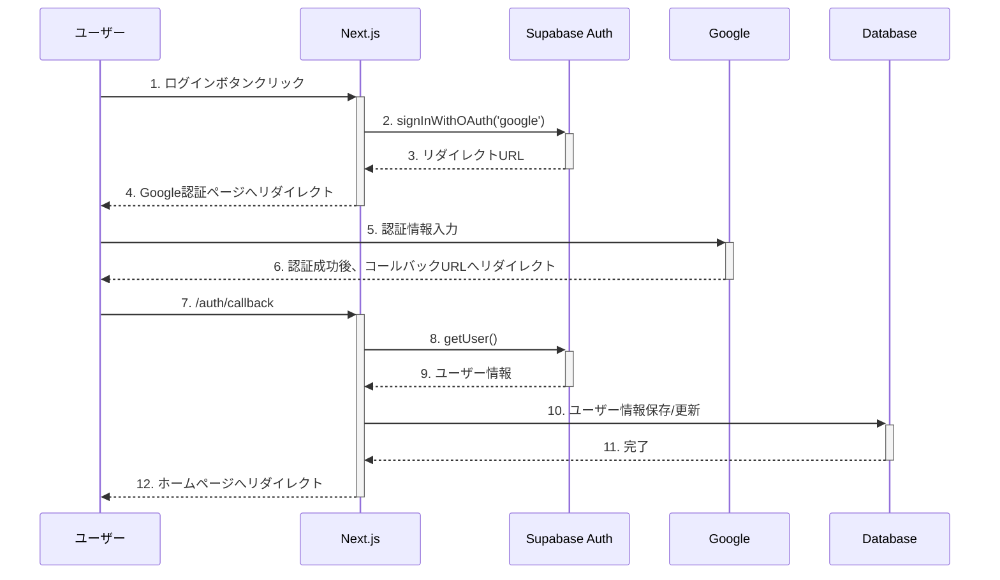

# セキュリティ詳細設計書

## 目次
1. [認証・認可](#1-認証認可)
2. [データセキュリティ](#2-データセキュリティ)
3. [フロントエンドセキュリティ](#3-フロントエンドセキュリティ)
4. [通信セキュリティ](#4-通信セキュリティ)
5. [セキュリティ監視・評価](#5-セキュリティ監視評価)
6. [今後の計画](#6-今後の計画)

## 1. 認証・認可

### 1.1 認証システム概要

「カタマリ」では、Supabase Authenticationを利用して認証機能を実装しています：

- **Google OAuth 2.0**: プライマリ認証方式
- **セッション管理**: JWTによるステートレスセッション
- **認証状態の永続化**: HTTPOnly Cookieでのセッション維持

### 1.2 認証フロー詳細

#### 1.2.1 Google OAuth認証フロー

#### 1.2.2 ユーザー自動登録とセッション管理

ユーザー認証後、Supabaseのトリガー機能を使って自動的に`public.users`テーブルにユーザー情報を登録します。認証情報の保護として次の設定を使用しています：

- **JWT有効期限**: 24時間
- **リフレッシュトークン有効期限**: 7日間
- **トークン保存方法**: HTTPOnly Cookieでの保存（XSS対策）

### 1.3 認可ポリシー（RLS）

主要テーブルに対する行レベルセキュリティ（RLS）ポリシーを実装しています：

#### 1.3.1 usersテーブルのRLSポリシー

- ユーザー情報の閲覧は全体に公開
- 自分のプロフィールのみ作成/更新/削除可能

#### 1.3.2 articlesテーブルのRLSポリシー

- 公開状態の記事または自分の記事のみ閲覧可能
- 記事の作成/更新/削除は著者のみ可能

#### 1.3.3 favoritesテーブルのRLSポリシー

- 自分のお気に入り情報のみ閲覧/追加/削除可能
- お気に入りされた記事IDでフィルタした一覧取得も可能

#### 1.3.4 ストレージRLSポリシー

- 公開ファイルは誰でも閲覧可能
- ファイルのアップロード/削除は所有者のみ可能

## 2. データセキュリティ

### 2.1 データベースセキュリティ

- **SSL接続**: PostgreSQLへの接続は暗号化
- **パラメータ化クエリ**: SQLインジェクション対策
- **最小権限の原則**: 必要最小限の権限のみを付与
- **データの暗号化**: 機密データは保存時に暗号化

### 2.2 ストレージセキュリティ

- **アクセス制御**: RLSによる厳格なアクセス制御
- **ファイル検証**: アップロード前に形式とサイズを検証
- **安全なファイル名**: ランダムなUUIDを使用して生成
- **アップロード上限**: ファイルサイズの上限設定（モデルファイル: 50MB、サムネイル: 5MB）

### 2.3 環境変数の保護

- **環境変数の分離**: 開発・本番環境の分離
- **シークレット管理**: 機密情報は環境変数として保存
- **クライアント側の制限**: クライアント側からアクセスできる環境変数は限定的

## 3. フロントエンドセキュリティ

### 3.1 XSS（クロスサイトスクリプティング）対策

- **React DOMエスケープ**: Reactの自動エスケープ機能の活用
- **Content Security Policy (CSP)**: スクリプト、スタイル、その他リソースの実行制限
- **HTTPOnly Cookie**: 認証情報の保護
- **dangerouslySetInnerHTML の回避**: ユーザー入力のHTML挿入を回避

### 3.2 CSRF（クロスサイトリクエストフォージェリ）対策

- **SameSite Cookie**: Cookieの送信を同一サイトに制限
- **Referrer Policy**: 機密情報を含むURLの漏洩防止

### 3.3 入力値検証

すべてのユーザー入力には適切なバリデーションを実装：

- フォームデータの型・長さ・形式チェック
- API入力パラメータのバリデーション
- ファイルアップロード時の拡張子・サイズ・MIMEタイプ検証

## 4. 通信セキュリティ

### 4.1 HTTPS

- 全ての通信はHTTPSで暗号化
- 自動的にHTTPからHTTPSへリダイレクト
- Strict-Transport-Security (HSTS) ヘッダーの設定

### 4.2 APIエンドポイントの保護

- レート制限: APIリクエスト数の制限
- APIキー管理: クライアント側の.envファイルでキーを管理
- Supabase JWT検証: API認証の自動化

### 4.3 CORS設定

- 適切なAccess-Control-Allow-Origin設定
- クレデンシャルを含むリクエストの制限
- プリフライトリクエストの処理

## 5. セキュリティ監視・評価

### 5.1 セキュリティテスト

- コードレビュー時のセキュリティチェック
- npm auditによる依存パッケージの脆弱性チェック
- 定期的なセキュリティスキャン

### 5.2 インシデント対応

- セキュリティインシデント検出手順
- インシデント報告・対応プロセス
- リカバリー計画（バックアップと復旧手順）

### 5.3 コンプライアンス

- 個人情報保護方針
- 利用規約とプライバシーポリシー
- 法的要件への対応

## 6. 今後の計画

プロジェクトの進展に応じて、以下のセキュリティ強化を計画しています：

### 6.1 セキュリティ強化項目

- 二要素認証の追加
- より詳細なセキュリティログの実装
- 定期的な脆弱性評価の自動化
- 管理者向けセキュリティダッシュボードの作成

### 6.2 優先度

| 強化項目 | 優先度 | 実装フェーズ |
|---------|-------|------------|
| セキュリティログの強化 | 高 | フェーズ2 |
| 依存パッケージの定期更新プロセス確立 | 高 | フェーズ2 |
| セキュリティスキャンの自動化 | 中 | フェーズ3 |
| 二要素認証 | 中 | フェーズ3 |
| 管理者向けセキュリティダッシュボード | 低 | フェーズ4 | 