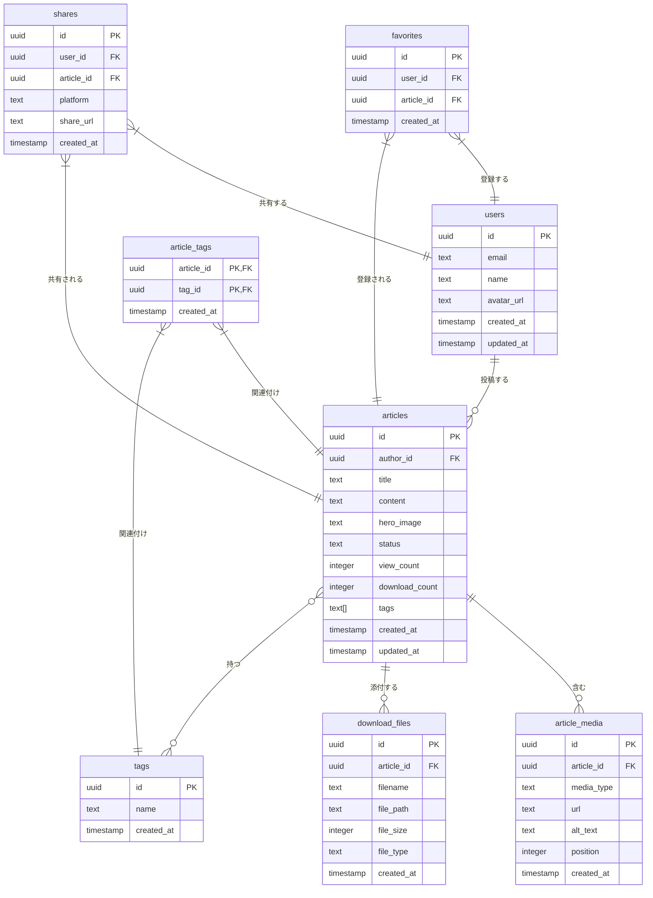

# データベース詳細設計書

## 1. テーブル構造

### 1.1 データベース概要

「カタマリ」のデータベースは、Supabase PostgreSQLを使用して実装されています。主要なテーブルは以下の通りです：

- **users** - ユーザー情報を管理するテーブル
- **articles** - 記事情報を管理するテーブル
- **article_media** - 記事に埋め込まれるメディアを管理するテーブル
- **download_files** - 記事に添付されるダウンロード用ファイルを管理するテーブル
- **tags** - タグ情報を管理するテーブル

### 1.1.1 ER図

以下のER図は、カタマリのデータベース構造を表しています。特に記事関連のテーブル間の関係性を示しています。



### 1.2 テーブル詳細定義

#### 1.2.1 usersテーブル

ユーザー情報を管理するテーブルです。Supabase Authenticationと連携しています。

| カラム名 | データ型 | 制約 | 説明 | 実装状況 |
| --- | --- | --- | --- | --- |
| id | uuid | PRIMARY KEY | ユーザーID | ✅ 実装済み |
| email | text | NOT NULL, UNIQUE | メールアドレス | ✅ 実装済み |
| name | text | NOT NULL | 表示名 | ✅ 実装済み |
| avatar_url | text |  | プロフィール画像URL | ✅ 実装済み |
| created_at | timestamp | NOT NULL, DEFAULT now() | 作成日時 | ✅ 実装済み |
| updated_at | timestamp | NOT NULL, DEFAULT now() | 更新日時 | ✅ 実装済み |

インデックス：
- PRIMARY KEY (id)
- UNIQUE (email)

#### 1.2.2 articlesテーブル

記事情報を管理するテーブルです。

| カラム名 | データ型 | 制約 | 説明 | 実装状況 |
| --- | --- | --- | --- | --- |
| id | uuid | PRIMARY KEY | 記事ID | ✅ 実装済み |
| author_id | uuid | NOT NULL, REFERENCES users(id) | 投稿者ID | ✅ 実装済み |
| title | text | NOT NULL | 記事タイトル | ✅ 実装済み |
| content | text | NOT NULL | 記事本文（リッチテキスト形式） | ✅ 実装済み |
| hero_image | text |  | ヒーロー画像URL | ❌ 実装予定 |
| status | text | NOT NULL | 公開ステータス（draft/published） | ❌ 実装予定 |
| view_count | integer | NOT NULL, DEFAULT 0 | 閲覧数 | ❌ 実装予定 |
| download_count | integer | NOT NULL, DEFAULT 0 | ダウンロード数 | ❌ 実装予定 |
| created_at | timestamp | NOT NULL, DEFAULT now() | 作成日時 | ✅ 実装済み |
| updated_at | timestamp | NOT NULL, DEFAULT now() | 更新日時 | ✅ 実装済み |

インデックス：
- PRIMARY KEY (id)
- FOREIGN KEY (author_id) REFERENCES users(id)
- INDEX (status)
- INDEX USING GIN (tags)

#### 1.2.3 article_mediaテーブル

記事に埋め込まれるメディア（画像、動画、3Dモデルなど）を管理するテーブルです。

| カラム名 | データ型 | 制約 | 説明 | 実装状況 |
| --- | --- | --- | --- | --- |
| id | uuid | PRIMARY KEY | メディアID | ❌ 実装予定 |
| article_id | uuid | NOT NULL, REFERENCES articles(id) | 記事ID | ❌ 実装予定 |
| media_type | text | NOT NULL | メディアタイプ（image/video/model） | ❌ 実装予定 |
| url | text | NOT NULL | メディアURL | ❌ 実装予定 |
| alt_text | text |  | 代替テキスト | ❌ 実装予定 |
| position | integer |  | 記事内の表示位置 | ❌ 実装予定 |
| created_at | timestamp | NOT NULL, DEFAULT now() | 作成日時 | ❌ 実装予定 |

インデックス：
- PRIMARY KEY (id)
- FOREIGN KEY (article_id) REFERENCES articles(id)
- INDEX (media_type)

#### 1.2.4 download_filesテーブル

記事に添付されるダウンロード用ファイル（3Dモデルや関連ファイル）を管理するテーブルです。

| カラム名 | データ型 | 制約 | 説明 | 実装状況 |
| --- | --- | --- | --- | --- |
| id | uuid | PRIMARY KEY | ファイルID | ❌ 実装予定 |
| article_id | uuid | NOT NULL, REFERENCES articles(id) | 記事ID | ❌ 実装予定 |
| filename | text | NOT NULL | ファイル名 | ❌ 実装予定 |
| file_path | text | NOT NULL | ファイルパス | ❌ 実装予定 |
| file_size | integer | NOT NULL | ファイルサイズ（バイト） | ❌ 実装予定 |
| file_type | text |  | ファイル種別（stl/obj/other） | ❌ 実装予定 |
| created_at | timestamp | NOT NULL, DEFAULT now() | 作成日時 | ❌ 実装予定 |

インデックス：
- PRIMARY KEY (id)
- FOREIGN KEY (article_id) REFERENCES articles(id)
- INDEX (file_type)

### 1.3 テーブル作成SQL

```sql
-- users table
CREATE TABLE users (
  id UUID PRIMARY KEY REFERENCES auth.users ON DELETE CASCADE,
  email TEXT NOT NULL UNIQUE,
  name TEXT NOT NULL,
  avatar_url TEXT,
  created_at TIMESTAMP WITH TIME ZONE NOT NULL DEFAULT now(),
  updated_at TIMESTAMP WITH TIME ZONE NOT NULL DEFAULT now()
);

-- articles table
CREATE TABLE articles (
  id UUID PRIMARY KEY DEFAULT uuid_generate_v4(),
  author_id UUID NOT NULL REFERENCES users(id) ON DELETE CASCADE,
  title TEXT NOT NULL,
  content TEXT NOT NULL,
  hero_image TEXT,
  status TEXT NOT NULL DEFAULT 'draft',
  view_count INTEGER NOT NULL DEFAULT 0,
  download_count INTEGER NOT NULL DEFAULT 0,
  tags TEXT[],
  created_at TIMESTAMP WITH TIME ZONE NOT NULL DEFAULT now(),
  updated_at TIMESTAMP WITH TIME ZONE NOT NULL DEFAULT now(),
  CONSTRAINT valid_status CHECK (status IN ('draft', 'published'))
);

-- article_media table
CREATE TABLE article_media (
  id UUID PRIMARY KEY DEFAULT uuid_generate_v4(),
  article_id UUID NOT NULL REFERENCES articles(id) ON DELETE CASCADE,
  media_type TEXT NOT NULL,
  url TEXT NOT NULL,
  alt_text TEXT,
  position INTEGER,
  created_at TIMESTAMP WITH TIME ZONE NOT NULL DEFAULT now(),
  CONSTRAINT valid_media_type CHECK (media_type IN ('image', 'video', 'model'))
);

-- download_files table
CREATE TABLE download_files (
  id UUID PRIMARY KEY DEFAULT uuid_generate_v4(),
  article_id UUID NOT NULL REFERENCES articles(id) ON DELETE CASCADE,
  filename TEXT NOT NULL,
  file_path TEXT NOT NULL,
  file_size INTEGER NOT NULL,
  file_type TEXT,
  created_at TIMESTAMP WITH TIME ZONE NOT NULL DEFAULT now()
);

-- Create indexes
CREATE INDEX idx_articles_status ON articles(status);
CREATE INDEX idx_articles_tags ON articles USING GIN(tags);
CREATE INDEX idx_article_media_article_id ON article_media(article_id);
CREATE INDEX idx_article_media_type ON article_media(media_type);
CREATE INDEX idx_download_files_article_id ON download_files(article_id);
CREATE INDEX idx_download_files_type ON download_files(file_type);
```

## 2. データベースセキュリティ（RLS）

### 2.1 Row Level Security (RLS) 概要

SupabaseのRow Level Security (RLS) は、テーブルの各行へのアクセス制御を行う機能です。カタマリでは以下のポリシーを実装しています：

### 2.2 usersテーブルのRLSポリシー

```sql
-- 読み取りポリシー（全ユーザー情報は公開）
CREATE POLICY "ユーザー情報は全体に公開" ON users
  FOR SELECT USING (true);

-- 更新ポリシー（自分のプロフィールのみ更新可能）
CREATE POLICY "自分のプロフィールのみ更新可能" ON users
  FOR UPDATE USING (auth.uid() = id);
```

### 2.3 articlesテーブルのRLSポリシー

```sql
-- 読み取りポリシー（公開記事は全体に公開）
CREATE POLICY "公開記事は全体に公開" ON articles
    FOR SELECT USING (status = 'published' OR auth.uid() = author_id);

-- 挿入ポリシー（認証済みユーザーのみ）
CREATE POLICY "ユーザーは自分の記事のみ投稿可能" ON articles
    FOR INSERT WITH CHECK (auth.uid() = author_id);

-- 更新・削除ポリシー（自分の記事のみ）
CREATE POLICY "自分の記事のみ更新可能" ON articles
    FOR UPDATE USING (auth.uid() = author_id);

CREATE POLICY "自分の記事のみ削除可能" ON articles
    FOR DELETE USING (auth.uid() = author_id);
```

### 2.4 article_mediaテーブルのRLSポリシー

article_mediaテーブルでは、記事に関連付けられたメディア（画像、動画、3Dモデル）の情報を保護します。基本的なアクセス制御は以下の通りです：

1. **読み取りアクセス**：
   - 公開記事に関連付けられたメディアは誰でも閲覧可能
   - 下書き記事のメディアは作成者のみ閲覧可能

2. **書き込み・更新・削除アクセス**：
   - 記事の作成者のみが自分の記事に関連するメディアを操作可能

```sql
-- 読み取りポリシー（記事が公開されているか、自分の記事のメディアのみ表示）
CREATE POLICY "公開記事のメディアは全体に公開" ON article_media
    FOR SELECT USING (
        EXISTS (
            SELECT 1 FROM articles
            WHERE articles.id = article_id
            AND (articles.status = 'published' OR articles.author_id = auth.uid())
        )
    );

-- 挿入ポリシー（自分の記事のメディアのみ）
CREATE POLICY "自分の記事のメディアのみ追加可能" ON article_media
    FOR INSERT WITH CHECK (
        EXISTS (
            SELECT 1 FROM articles
            WHERE articles.id = article_id
            AND articles.author_id = auth.uid()
        )
    );

-- 更新ポリシー（自分の記事のメディアのみ）
CREATE POLICY "自分の記事のメディアのみ更新可能" ON article_media
    FOR UPDATE USING (
        EXISTS (
            SELECT 1 FROM articles
            WHERE articles.id = article_id
            AND articles.author_id = auth.uid()
        )
    );

-- 削除ポリシー（自分の記事のメディアのみ）
CREATE POLICY "自分の記事のメディアのみ削除可能" ON article_media
    FOR DELETE USING (
        EXISTS (
            SELECT 1 FROM articles
            WHERE articles.id = article_id
            AND articles.author_id = auth.uid()
        )
    );
```

### 2.5 download_filesテーブルのRLSポリシー

download_filesテーブルでは、記事に添付された制作ファイル一式の情報を保護します。フォルダ構造を維持したファイルアップロードに対応するため、より複雑なポリシーが必要です：

1. **読み取りアクセス**：
   - 公開記事のファイル情報は誰でも閲覧可能
   - 下書き記事のファイル情報は作成者のみ閲覧可能

2. **書き込み・更新・削除アクセス**：
   - 記事の作成者のみが自分の記事に関連するファイルを操作可能

```sql
-- 読み取りポリシー（記事が公開されているか、自分の記事のファイルのみ表示）
CREATE POLICY "公開記事のファイルは全体に公開" ON download_files
    FOR SELECT USING (
        EXISTS (
            SELECT 1 FROM articles
            WHERE articles.id = article_id
            AND (articles.status = 'published' OR articles.author_id = auth.uid())
        )
    );

-- 挿入ポリシー（自分の記事のファイルのみ）
CREATE POLICY "自分の記事のファイルのみ追加可能" ON download_files
    FOR INSERT WITH CHECK (
        EXISTS (
            SELECT 1 FROM articles
            WHERE articles.id = article_id
            AND articles.author_id = auth.uid()
        )
    );

-- 更新ポリシー（自分の記事のファイルのみ）
CREATE POLICY "自分の記事のファイルのみ更新可能" ON download_files
    FOR UPDATE USING (
        EXISTS (
            SELECT 1 FROM articles
            WHERE articles.id = article_id
            AND articles.author_id = auth.uid()
        )
    );

-- 削除ポリシー（自分の記事のファイルのみ）
CREATE POLICY "自分の記事のファイルのみ削除可能" ON download_files
    FOR DELETE USING (
        EXISTS (
            SELECT 1 FROM articles
            WHERE articles.id = article_id
            AND articles.author_id = auth.uid()
        )
    );
```

### 2.6 フォルダ構造を維持したファイル管理のRLS実装例

フォルダ構造を維持したファイル管理では、ファイルパスの検証と適切なアクセス制御が重要です。特にストレージレベルでのRLSポリシーは慎重に設計する必要があります：

```sql
-- ストレージのRLSポリシー（articlesバケット）
-- フォルダ構造を維持したファイルアクセス制御

-- 読み取りポリシー（公開記事のファイルは誰でも読み取り可能）
CREATE POLICY "公開記事のファイルは閲覧可能" ON storage.objects
FOR SELECT USING (
  bucket_id = 'articles' AND (
    EXISTS (
      SELECT 1 FROM articles a
      WHERE a.id::text = (storage.foldername(name))[2]
      AND a.status = 'published'
    )
  )
);

-- 読み取りポリシー（自分の記事のファイルは閲覧可能）
CREATE POLICY "自分の記事のファイルは閲覧可能" ON storage.objects
FOR SELECT USING (
  bucket_id = 'articles' AND (
    EXISTS (
      SELECT 1 FROM articles a
      WHERE a.id::text = (storage.foldername(name))[2]
      AND a.author_id = auth.uid()
    )
  )
);

-- 書き込みポリシー（自分の記事のファイルのみアップロード可能）
CREATE POLICY "自分の記事のファイルのみアップロード可能" ON storage.objects
FOR INSERT WITH CHECK (
  bucket_id = 'articles' AND (
    EXISTS (
      SELECT 1 FROM articles a
      WHERE a.id::text = (storage.foldername(name))[2]
      AND a.author_id = auth.uid()
    )
  )
);

-- 削除ポリシー（自分の記事のファイルのみ削除可能）
CREATE POLICY "自分の記事のファイルのみ削除可能" ON storage.objects
FOR DELETE USING (
  bucket_id = 'articles' AND (
    EXISTS (
      SELECT 1 FROM articles a
      WHERE a.id::text = (storage.foldername(name))[2]
      AND a.author_id = auth.uid()
    )
  )
);
```

### 2.7 RLSの検証方法

RLSポリシーを正しく実装するためには、以下の手順で検証を行います：

1. **異なるユーザーロールでのテスト**
   - 匿名ユーザー：公開記事のみ閲覧可能か
   - 認証済みユーザー（記事作成者）：自分の記事の閲覧・編集・削除が可能か
   - 認証済みユーザー（他のユーザー）：他人の公開記事のみ閲覧可能か

2. **エッジケースのテスト**
   - 下書き記事が他のユーザーに見えないか
   - 削除された記事に関連するメディアやファイルが適切に処理されるか
   - パストラバーサル攻撃が防止されているか

## 3. ストレージ設計

### 3.1 バケット構成

Supabaseストレージを使用して、以下の4つのバケットを設定します：

1. **articles**: 記事に添付するファイル一式を保存するためのバケット（フォルダ構造維持）
   - アクセス制御: 公開読み取り、認証済みアップロード
   - 命名規則: `{user_id}/{article_id}/{relative_path}/{original_filename}`
   - 最大サイズ: 100MB

2. **thumbnails**: 記事のヒーロー画像やサムネイル画像を保存するためのバケット
   - アクセス制御: 公開読み取り、認証済みアップロード
   - 命名規則: `{user_id}/{article_id}/{timestamp}_${uuidv4()}.${fileExt}`
   - 最大サイズ: 2MB

3. **media**: 記事内に埋め込むメディアファイル（画像、動画）を保存するためのバケット
   - アクセス制御: 公開読み取り、認証済みアップロード
   - 命名規則: `{user_id}/{article_id}/{timestamp}_${uuidv4()}.${fileExt}`
   - 最大サイズ: 20MB

4. **avatars**: ユーザーのアバター画像を保存するためのバケット
   - アクセス制御: 公開読み取り、認証済みアップロード
   - 命名規則: `{user_id}/{timestamp}_${uuidv4()}.${fileExt}`
   - 最大サイズ: 5MB

### 3.2 ストレージRLSポリシー

```sql
-- アップロード権限
CREATE POLICY "ユーザーは自分のファイルをアップロードできる" 
ON storage.objects FOR INSERT 
WITH CHECK (auth.uid()::text = (storage.foldername())[1]);

-- 参照権限（公開アクセス）
CREATE POLICY "誰でもファイルを参照できる" 
ON storage.objects FOR SELECT 
USING (bucket_id = 'articles' OR bucket_id = 'thumbnails' OR bucket_id = 'media' OR bucket_id = 'avatars');

-- 削除権限（自分のファイルのみ）
CREATE POLICY "ユーザーは自分のファイルを削除できる" 
ON storage.objects FOR DELETE 
USING (auth.uid()::text = (storage.foldername())[1]);
```

### 3.3 ストレージバケットの作成

```sql
-- ストレージバケットの作成
INSERT INTO storage.buckets (id, name) VALUES ('articles', '記事に添付するファイル一式');
INSERT INTO storage.buckets (id, name) VALUES ('thumbnails', 'サムネイル画像');
INSERT INTO storage.buckets (id, name) VALUES ('media', '記事内に埋め込むメディア');
INSERT INTO storage.buckets (id, name) VALUES ('avatars', 'アバター画像');

-- ストレージのポリシー
-- 記事ファイル
CREATE POLICY "記事は公開で読み取り可能" ON storage.objects
FOR SELECT USING (bucket_id = 'articles');

CREATE POLICY "認証済みユーザーは記事をアップロード可能" ON storage.objects
FOR INSERT WITH CHECK (bucket_id = 'articles' AND auth.uid() = (storage.foldername(name))[1]::uuid);

CREATE POLICY "ユーザーは自分の記事のみ削除可能" ON storage.objects
FOR DELETE USING (bucket_id = 'articles' AND auth.uid() = (storage.foldername(name))[1]::uuid);

-- サムネイル画像
CREATE POLICY "サムネイルは公開で読み取り可能" ON storage.objects
FOR SELECT USING (bucket_id = 'thumbnails');

CREATE POLICY "認証済みユーザーはサムネイルをアップロード可能" ON storage.objects
FOR INSERT WITH CHECK (bucket_id = 'thumbnails' AND auth.uid() = (storage.foldername(name))[1]::uuid);

CREATE POLICY "ユーザーは自分のサムネイルのみ削除可能" ON storage.objects
FOR DELETE USING (bucket_id = 'thumbnails' AND auth.uid() = (storage.foldername(name))[1]::uuid);

-- メディアファイル
CREATE POLICY "メディアは公開で読み取り可能" ON storage.objects
FOR SELECT USING (bucket_id = 'media');

CREATE POLICY "認証済みユーザーはメディアをアップロード可能" ON storage.objects
FOR INSERT WITH CHECK (bucket_id = 'media' AND auth.uid() = (storage.foldername(name))[1]::uuid);

CREATE POLICY "ユーザーは自分のメディアのみ削除可能" ON storage.objects
FOR DELETE USING (bucket_id = 'media' AND auth.uid() = (storage.foldername(name))[1]::uuid);

-- アバター画像
CREATE POLICY "アバターは公開で読み取り可能" ON storage.objects
FOR SELECT USING (bucket_id = 'avatars');

CREATE POLICY "認証済みユーザーはアバターをアップロード可能" ON storage.objects
FOR INSERT WITH CHECK (bucket_id = 'avatars' AND auth.uid() = (storage.foldername(name))[1]::uuid);

CREATE POLICY "ユーザーは自分のアバターのみ削除可能" ON storage.objects
FOR DELETE USING (bucket_id = 'avatars' AND auth.uid() = (storage.foldername(name))[1]::uuid);
```

## 4. データ操作パターン

### 4.1 ユーザー登録・更新フロー

1. ユーザーがGoogle OAuth認証を通じて認証
2. 認証成功後、ユーザー情報をusersテーブルに挿入または更新（トリガー経由）
3. 認証トークンをCookieに保存（`sb-xxx-auth-token`）
4. Next.js App Routerのサーバーコンポーネントは`cookies()`関数を使ってCookieにアクセスし、認証状態を確認
5. クライアントコンポーネントはブラウザのCookieから認証トークンを利用
6. プロフィール更新時は、認証済みSupabaseクライアントを通じて更新データをusersテーブルに反映

### 4.2 記事登録フロー

1. ユーザーが記事情報、メディアファイル、添付ファイルを入力
2. リッチテキストエディタの内容がJSON形式で保存
3. ファイルを`articles`バケットにアップロード（フォルダ構造維持）
4. メディア（画像・動画）を`media`バケットにアップロード
5. サムネイル（ヒーロー画像）がある場合は`thumbnails`バケットにアップロード
6. 保存されたファイルのURLを取得
7. 記事情報、メディア情報、ファイル情報をそれぞれのテーブルに挿入

### 4.3 記事更新・削除フロー

1. 記事更新時は、既存の記事情報をarticlesテーブルから取得
2. 更新したい情報を変更（ファイルの変更がある場合は新しいファイルをアップロード）
3. 更新情報をarticlesテーブル、article_mediaテーブル、download_filesテーブルに反映
4. 記事削除時は、関連ファイルをストレージから削除
5. 記事情報をarticlesテーブルから削除（カスケード削除により関連レコードも削除）

### 4.4 データベースセットアップSQL

以下は、カタマリのデータベースを初期化するためのSQLスクリプトです：

```sql
-- ユーザープロフィールテーブル
CREATE TABLE profiles (
  id UUID REFERENCES auth.users PRIMARY KEY,
  username TEXT UNIQUE NOT NULL,
  display_name TEXT,
  avatar_url TEXT,
  bio TEXT,
  created_at TIMESTAMP WITH TIME ZONE DEFAULT TIMEZONE('utc'::text, NOW()) NOT NULL,
  updated_at TIMESTAMP WITH TIME ZONE DEFAULT TIMEZONE('utc'::text, NOW()) NOT NULL
);

-- ストレージバケットの作成
INSERT INTO storage.buckets (id, name) VALUES ('article_files', '記事ファイル');
INSERT INTO storage.buckets (id, name) VALUES ('article_thumbnails', 'サムネイル画像');
INSERT INTO storage.buckets (id, name) VALUES ('avatars', 'アバター画像');

-- ストレージのポリシー
-- 記事ファイル
CREATE POLICY "記事は公開で読み取り可能" ON storage.objects
FOR SELECT USING (bucket_id = 'article_files');

CREATE POLICY "認証済みユーザーは記事をアップロード可能" ON storage.objects
FOR INSERT WITH CHECK (bucket_id = 'article_files' AND auth.uid() = (storage.foldername(name))[1]::uuid);

CREATE POLICY "ユーザーは自分の記事のみ削除可能" ON storage.objects
FOR DELETE USING (bucket_id = 'article_files' AND auth.uid() = (storage.foldername(name))[1]::uuid);

-- サムネイル
CREATE POLICY "サムネイルは公開で読み取り可能" ON storage.objects
FOR SELECT USING (bucket_id = 'article_thumbnails');

CREATE POLICY "認証済みユーザーはサムネイルをアップロード可能" ON storage.objects
FOR INSERT WITH CHECK (bucket_id = 'article_thumbnails' AND auth.uid() = (storage.foldername(name))[1]::uuid);

CREATE POLICY "ユーザーは自分のサムネイルのみ削除可能" ON storage.objects
FOR DELETE USING (bucket_id = 'article_thumbnails' AND auth.uid() = (storage.foldername(name))[1]::uuid);

-- アバター画像
CREATE POLICY "アバターは公開で読み取り可能" ON storage.objects
FOR SELECT USING (bucket_id = 'avatars');

CREATE POLICY "認証済みユーザーはアバターをアップロード可能" ON storage.objects
FOR INSERT WITH CHECK (bucket_id = 'avatars' AND auth.uid() = (storage.foldername(name))[1]::uuid);

CREATE POLICY "ユーザーは自分のアバターのみ削除可能" ON storage.objects
FOR DELETE USING (bucket_id = 'avatars' AND auth.uid() = (storage.foldername(name))[1]::uuid);
```

## 5. マイグレーション戦略

現在、明示的なマイグレーション戦略は実装されていませんが、将来的には以下のアプローチを検討中です：

1. スキーマの変更はSupabaseコンソールで管理
2. 重要な変更はSQL DDLスクリプトとして保存
3. 必要に応じてデータの変換ロジックを実装
4. テスト環境での検証後、本番環境に適用

## 6. キャッシュ戦略

現在、クライアント側でのデータキャッシュはSWRを使用して実装しています：

1. SWRを使用したメモリキャッシュ
2. Revalidationトリガーを適切に設定
3. 更新頻度の低いデータに対してはキャッシュ時間を長く設定
4. クライアント側のキャッシュ状態をContextAPIで管理

## 7. 将来的な拡張計画

### 7.1 フェーズ2での優先追加テーブル

1. **favorites** - 記事のお気に入り情報を管理するテーブル
   
   | カラム名 | データ型 | 制約 | 説明 |
   | --- | --- | --- | --- |
   | id | uuid | PRIMARY KEY | お気に入りID |
   | user_id | uuid | NOT NULL, REFERENCES users(id) | お気に入り登録したユーザーID |
   | article_id | uuid | NOT NULL, REFERENCES articles(id) | お気に入り登録された記事ID |
   | created_at | timestamp | NOT NULL, DEFAULT now() | 作成日時 |
   
   インデックス：
   - PRIMARY KEY (id)
   - UNIQUE (user_id, article_id)
   - INDEX (article_id)

2. **shares** - 記事のSNS共有情報を管理するテーブル
   
   | カラム名 | データ型 | 制約 | 説明 |
   | --- | --- | --- | --- |
   | id | uuid | PRIMARY KEY | 共有ID |
   | user_id | uuid | NOT NULL, REFERENCES users(id) | 共有したユーザーID |
   | article_id | uuid | NOT NULL, REFERENCES articles(id) | 共有された記事ID |
   | platform | text | NOT NULL | 共有先プラットフォーム（twitter, instagram等） |
   | share_url | text | | 共有されたURL |
   | created_at | timestamp | NOT NULL, DEFAULT now() | 作成日時 |
   
   インデックス：
   - PRIMARY KEY (id)
   - INDEX (article_id)
   - INDEX (user_id)

3. **tags** - 記事のタグを管理するテーブル
   
   | カラム名 | データ型 | 制約 | 説明 |
   | --- | --- | --- | --- |
   | id | uuid | PRIMARY KEY | タグID |
   | name | text | NOT NULL, UNIQUE | タグ名 |
   | created_at | timestamp | NOT NULL, DEFAULT now() | 作成日時 |
   
   インデックス：
   - PRIMARY KEY (id)
   - UNIQUE (name)

4. **article_tags** - 記事とタグの関連付けを管理する中間テーブル
   
   | カラム名 | データ型 | 制約 | 説明 |
   | --- | --- | --- | --- |
   | article_id | uuid | NOT NULL, REFERENCES articles(id) | 記事ID |
   | tag_id | uuid | NOT NULL, REFERENCES tags(id) | タグID |
   | created_at | timestamp | NOT NULL, DEFAULT now() | 作成日時 |
   
   インデックス：
   - PRIMARY KEY (article_id, tag_id)
   - INDEX (tag_id)

### 7.2 その他の検討中テーブル

1. **comments** - 記事へのコメントを管理するテーブル 
2. **follows** - ユーザー間のフォロー関係を管理するテーブル
3. **usage_examples** - 記事の使用事例を管理するテーブル

### 7.3 拡張予定のカラム

1. articlesテーブルに以下のカラムを追加予定：
   - **tags**: 文字列配列型（タグ付け機能として）
   - **download_count**: 整数型（ダウンロード数カウント用）
   - **favorite_count**: 整数型（お気に入り数カウント用・デノーマライズドカラム）
   - **share_count**: 整数型（共有数カウント用・デノーマライズドカラム）

2. usersテーブルに以下のカラムを追加予定：
   - **bio**: テキスト型（プロフィール文）
   - **social_links**: JSONB型（各種SNSリンク）
   - **article_count**: 整数型（投稿記事数・デノーマライズドカラム）
   - **follower_count**: 整数型（フォロワー数・デノーマライズドカラム）

### 7.4 検索最適化

フェーズ2では検索機能を強化するために、以下の対応を優先的に実施します：

1. 全文検索インデックスの追加
   ```sql
   CREATE EXTENSION IF NOT EXISTS pg_trgm;
   
   CREATE INDEX idx_articles_title_trgm ON articles USING GIN (title gin_trgm_ops);
   CREATE INDEX idx_articles_content_trgm ON articles USING GIN (content gin_trgm_ops);
   ```

2. タグ検索のための最適化
   ```sql
   CREATE INDEX idx_tags_name_trgm ON tags USING GIN (name gin_trgm_ops);
   ```

3. PostgreSQLの拡張機能を活用した曖昧検索の実装
   ```sql
   CREATE OR REPLACE FUNCTION search_articles(search_term TEXT)
   RETURNS SETOF articles AS $$
   BEGIN
     RETURN QUERY
     SELECT *
     FROM articles
     WHERE title ILIKE '%' || search_term || '%'
     OR content ILIKE '%' || search_term || '%'
     ORDER BY 
       CASE 
         WHEN title ILIKE search_term THEN 0
         WHEN title ILIKE search_term || '%' THEN 1
         WHEN title ILIKE '%' || search_term || '%' THEN 2
         ELSE 3
       END,
       created_at DESC;
   END;
   $$ LANGUAGE plpgsql; 