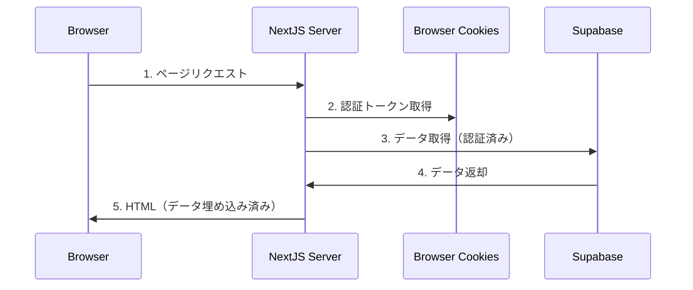
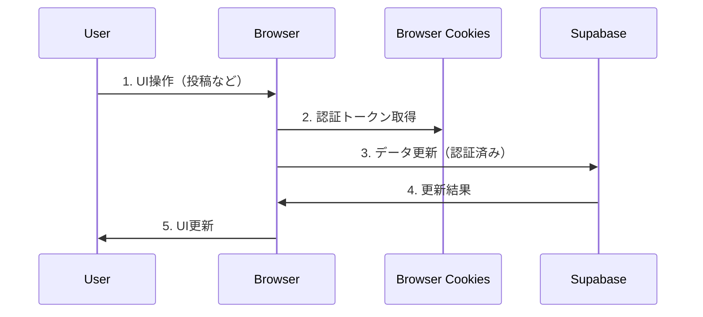
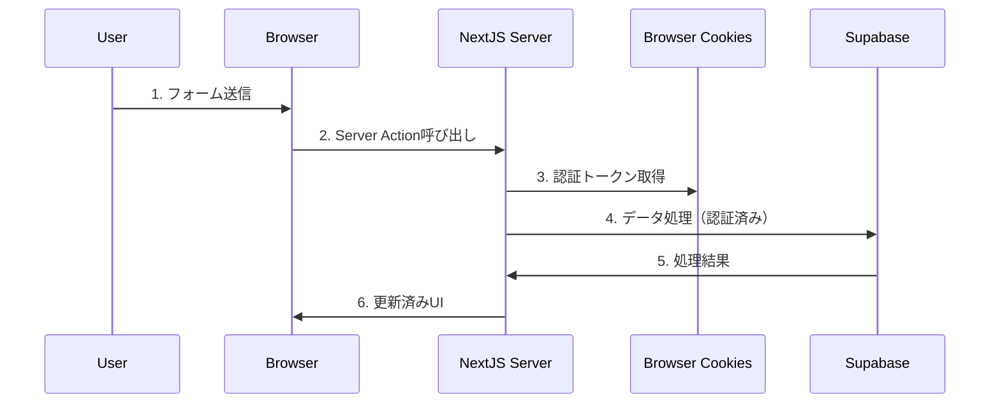

# カタマリ 認証フロー詳細設計書

## 1. 認証アーキテクチャ概要

カタマリプラットフォームでは、Next.js App RouterとSupabase Authを組み合わせたハイブリッド認証アーキテクチャを採用しています。このアプローチにより、サーバーサイドレンダリングの利点（SEO、初期ロード速度）とクライアントサイドの柔軟性を両立させています。

### 1.1 アーキテクチャ図

```
┌────────────────────────────────┐                ┌─────────────────────┐
│         クライアント        　   │                │       サーバー       │
│  ┌────────────────────────┐    │                │                     │
│  │      ブラウザ           │    │                │  ┌───────────────┐  │
│  │  ┌────────────────┐    │    │                │  │   Next.js     │  │
│  │  │    Cookies     │    │    │                │  │               │  │
│  │  │ ┌────────────┐ │    │    │                │  │ ┌───────────┐ │  │
│  │  │ │ Supabase   │ │    │    │                │  │ │サーバー    │ │  │
│  │  │ │ Auth Token │ │<───┼────┼────────────────┼──┼─│コンポーネント│ │  │
│  │  │ └────────────┘ │    │    │                │  │ │           │ │  │
│  │  └────────────────┘    │    │                │  │ └───────────┘ │  │
│  │                        │    │                │  │               │  │
│  │  ┌────────────────┐    │    │                │  │ ┌───────────┐ │  │
│  │  │  LocalStorage  │    │    │   セッション検証   │  │ │ Supabase │ │  │
│  │  │ ┌────────────┐ │    │    │ ┌──────────────┼──┼─│ Auth API  │ │  │
│  │  │ │ユーザー情報  │ │<───┼────┼─│              │  │ │          │ │  │
│  │  │ └────────────┘ │    │    │                │  │ └───────────┘ │  │
│  │  └────────────────┘    │    │                │  │               │  │
│  └────────────────────────┘    │                │  └───────────────┘  │
└────────────────────────────────┘                └─────────────────────┘
```

### 1.2 使用する主要なコンポーネント

- **Next.js App Router**: ページレンダリングとルーティングを担当
- **Supabase Auth**: 認証機能を提供
- **Cookie**: 認証トークンの保存に使用

## 2. 認証フロー詳細

### 2.1 ログインフロー

```
┌───────────────┐      ┌───────────────┐      ┌───────────────┐
│               │      │               │      │               │
│   Browser     │ ──→  │   Supabase    │ ──→  │    Cookie     │
│   (Login)     │      │     Auth      │      │   Storage     │
│               │      │               │      │               │
└───────────────┘      └───────────────┘      └───────────────┘
```

1. ユーザーが`/login`ページにアクセスし、「Googleでログイン」ボタンをクリック
2. Supabase Auth APIが起動し、Googleの認証ページにリダイレクト
3. ユーザーがGoogleでログイン認証を完了
4. Googleが認証コードをリダイレクトURLに返す
5. Supabaseがこのコードを使ってアクセストークンと更新トークンを取得
6. トークンがCookieに保存される（`sb-xxx-auth-token`）
7. ユーザーはサイトにリダイレクトされる（通常はホームページ）

### 2.2 サーバーサイドレンダリングでの認証情報利用

```
┌───────────────┐      ┌───────────────┐      ┌───────────────┐
│               │      │               │      │               │
│    Cookie     │ ──→  │  Server       │ ──→  │   Supabase    │
│    Storage    │      │  Component    │      │     API       │
│               │      │               │      │               │
└───────────────┘      └───────────────┘      └───────────────┘
```

1. ユーザーがページにアクセス（例: `/articles`）
2. Next.jsサーバーがリクエストを処理
3. サーバーコンポーネントが実行され、`cookies()`関数を使ってCookieにアクセス
4. `createServerComponentClient({ cookies })`でSupabaseクライアントを初期化
5. 初期化されたクライアントが認証トークンを使用してSupabase APIにリクエスト
6. データが取得され、サーバーでHTMLがレンダリングされる
7. 完全にレンダリングされたHTMLがクライアントに送信される

### 2.3 クライアントサイドでの認証情報利用

```
┌───────────────┐      ┌───────────────┐      ┌───────────────┐
│               │      │               │      │               │
│    Cookie     │ ──→  │    Client     │ ──→  │   Supabase    │
│    Storage    │      │  Component    │      │     API       │
│               │      │               │      │               │
└───────────────┘      └───────────────┘      └───────────────┘
```

1. 'use client'ディレクティブが付与されたコンポーネントがブラウザで実行される
2. コンポーネント内で`createClientSupabase()`を呼び出す
3. ブラウザのCookieから認証トークンを取得
4. 認証済みの状態でSupabase APIにアクセス
5. データの取得・更新などの操作が実行される
6. UIが更新される

## 3. データアクセスパターン

### 3.1 初期ページロード（サーバーサイド）



- **ユースケース**: 記事一覧ページ、記事詳細ページなど
- **利点**: 高速な初期ページロード、SEO最適化、データのプリフェッチ
- **実装例**: `app/articles/page.tsx`, `app/articles/[id]/page.tsx`

### 3.2 クライアント操作（クライアントサイド）



- **ユースケース**: 新規記事作成、プロフィール編集など
- **利点**: インタラクティブなUI、ページリロードなしの操作
- **実装例**: `app/articles/new/page.tsx`, `app/profile/page.tsx`

### 3.3 Server Actions（ハイブリッド）



- **ユースケース**: ビューカウント増加、ファイルダウンロードなど
- **利点**: セキュアな処理、データ検証、インタラクティブなUI
- **実装例**: `incrementViewCount`関数（`app/articles/[id]/page.tsx`内）

## 4. 認証関連のコード実装

### 4.1 サーバーコンポーネントでの実装

```typescript
import { createServerComponentClient } from '@supabase/auth-helpers-nextjs';
import { cookies } from 'next/headers';

export default async function Page() {
  const supabase = createServerComponentClient({ cookies });
  
  // データの取得
  const { data, error } = await supabase
    .from('articles')
    .select('*');
    
  // ...
}
```

### 4.2 クライアントコンポーネントでの実装

```typescript
'use client';

import { useState, useEffect } from 'react';
import { createClientSupabase } from '@/lib/supabase-client';

export default function Component() {
  const [user, setUser] = useState(null);
  
  useEffect(() => {
    const checkAuth = async () => {
      const supabase = createClientSupabase();
      const { data: { user } } = await supabase.auth.getUser();
      setUser(user);
    };
    
    checkAuth();
  }, []);
  
  // ...
}
```

### 4.3 認証ヘルパー関数

```typescript
// lib/supabase-client.ts
import { createClientComponentClient } from '@supabase/auth-helpers-nextjs';

export const createClientSupabase = () => {
  return createClientComponentClient();
};
```

## 5. セキュリティ考慮事項

### 5.1 Cookieセキュリティ

- Supabaseが生成するCookieはデフォルトで以下の属性が設定されています:
  - **HttpOnly**: JavaScript経由のCookieアクセスを防止
  - **Secure**: HTTPS接続でのみCookieが送信される
  - **SameSite=Lax**: クロスサイトリクエストでのCookie送信を制限

### 5.2 認証状態の検証

- サーバーサイドでのリクエスト処理時に認証状態を検証
- 非認証ユーザーからの保護されたリソースへのアクセスを制限
- ミドルウェアによるルートベースの認証保護

### 5.3 RLS (Row Level Security)

- SupabaseのRLSポリシーによるデータベースレベルでのアクセス制御
- ユーザーは自分のデータのみにアクセス可能
- 公開リソースは明示的に定義されたポリシーに基づいてアクセス可能

## 6. トラブルシューティング

### 6.1 一般的な問題

- **認証状態の不一致**: サーバーとクライアント間で認証状態が同期されない
- **トークン期限切れ**: 認証トークンの有効期限が切れる
- **CORS問題**: クロスオリジンリクエストに関する問題

### 6.2 解決策

- **認証状態の不一致**: `createServerComponentClient`と`createClientSupabase`の一貫した使用
- **トークン期限切れ**: Supabaseの自動トークンリフレッシュ機能を活用
- **CORS問題**: Supabaseプロジェクト設定でCORSを適切に設定 

## 7. 認証トリガー実装

### 7.1 概要

認証トリガーは、ユーザーがGoogle OAuth認証を完了した際に、自動的にusersテーブルにレコードを作成するための仕組みです。このトリガーにより、認証プロセスとユーザー情報の管理が自動化されます。

### 7.2 実装詳細

以下のSQLコードにより、auth.usersテーブルへのレコード挿入をトリガーとして、public.usersテーブルにユーザー情報が自動的に作成または更新されます。

```sql
-- 認証トリガー関数
CREATE OR REPLACE FUNCTION public.handle_new_user() 
RETURNS trigger AS $$
BEGIN
  INSERT INTO public.users (id, email, name, default_avatar_url)
  VALUES (
    NEW.id, 
    NEW.email,
    COALESCE(NEW.raw_user_meta_data->>'full_name', split_part(NEW.email, '@', 1), 'User'),
    NEW.raw_user_meta_data->>'avatar_url'
  )
  ON CONFLICT (id) DO UPDATE
  SET 
    email = EXCLUDED.email,
    name = EXCLUDED.name,
    default_avatar_url = EXCLUDED.default_avatar_url,
    updated_at = now();
    
  RETURN NEW;
END;
$$ LANGUAGE plpgsql SECURITY DEFINER;

-- 認証トリガーの設定
CREATE TRIGGER on_auth_user_created
  AFTER INSERT ON auth.users
  FOR EACH ROW EXECUTE FUNCTION public.handle_new_user();
```

### 7.3 処理フロー

認証トリガーの実行フローは以下の通りです：

1. ユーザーがGoogleアカウントでログインする
2. Supabase Authenticationがユーザー情報を受け取り、auth.usersテーブルに保存
3. `on_auth_user_created`トリガーが発火し、`handle_new_user`関数を実行
4. 関数内でpublic.usersテーブルにユーザー情報が作成または更新される
5. 以下の情報が自動的に設定される：
   - ID: Google認証から取得したユニークID
   - メールアドレス: Googleアカウントのメールアドレス
   - 名前: Googleプロフィール名（ない場合はメールアドレスのユーザー部分、それもない場合は「User」）
   - アバター画像URL: `default_avatar_url`としてGoogleプロフィール画像のURLを保存
6. 既存ユーザーの場合は、情報が最新のGoogleアカウント情報で更新される

### 7.4 セキュリティ考慮事項

- 関数に`SECURITY DEFINER`属性を付与し、トリガー関数がデータベース所有者の権限で実行されるようにしています
- これにより、RLSポリシーに関係なくユーザーレコードの作成・更新が可能になります
- トリガーはauth.usersテーブルの挿入操作に対してのみ発火するため、不正な操作が行われる可能性は限定的です

### 7.5 メンテナンス考慮事項

- Googleの認証システム変更に伴い、メタデータの構造が変わる可能性があります
- 定期的にトリガー関数の動作を確認し、必要に応じて更新することが重要です
- ユーザー情報の追加フィールドが必要になった場合は、このトリガー関数を拡張する必要があります

## 8. 実装コード例

### 8.1 認証コールバックハンドラ

```tsx
// app/auth/callback/route.ts
import { createRouteHandlerClient } from '@supabase/auth-helpers-nextjs';
import { cookies } from 'next/headers';
import { NextResponse } from 'next/server';

export async function GET(request: Request) {
  const requestUrl = new URL(request.url);
  const code = requestUrl.searchParams.get('code');
  
  if (code) {
    const cookieStore = cookies();
    const supabase = createRouteHandlerClient({ cookies: () => cookieStore });
    
    await supabase.auth.exchangeCodeForSession(code);
  }
  
  return NextResponse.redirect(new URL('/dashboard', request.url));
}
```

### 8.2 クライアントサイドコールバックハンドラ

```tsx
// app/(auth)/callback/page.tsx
'use client';

import { useEffect } from 'react';
import { useRouter } from 'next/navigation';
import { createClientSupabase } from '@/lib/supabase-client';

export default function AuthCallbackPage() {
  const router = useRouter();

  useEffect(() => {
    const handleAuthCallback = async () => {
      try {
        const supabase = createClientSupabase();

        // URLからクエリパラメータを取得（Authorizationコードフロー）
        const { searchParams } = new URL(window.location.href);
        const code = searchParams.get('code');

        // codeパラメータがない場合は既に認証完了している可能性がある
        if (!code) {
          router.push('/');
          return;
        }

        // Authorization Code フロー
        const { error } = await supabase.auth.exchangeCodeForSession(code);

        if (error) {
          // セッションが既に有効な場合のエラーは無視
          if (error.message?.includes('invalid request') || error.message?.includes('code verifier')) {
            // セッション確認
            const { data: { session } } = await supabase.auth.getSession();
            if (session) {
              router.push('/');
              return;
            }
          }

          // 正常なエラーケース以外の場合のみスロー
          throw error;
        }

        // ログイン成功時にホームにリダイレクト
        router.push('/');
      } catch {
        // 致命的なエラーのみログに記録し、エラーページへリダイレクト
        router.push('/login?error=auth-callback-error');
      }
    };

    handleAuthCallback();
  }, [router]);

  return (
    <div className="flex items-center justify-center min-h-[50vh]">
      <div className="text-center">
        <h1 className="text-2xl font-bold mb-4">ログイン処理中...</h1>
        <p className="text-gray-600">しばらくお待ちください</p>
      </div>
    </div>
  );
}
```

### 8.3 認証エラーハンドリング

PKCEフローでは、以下のようなエラーが発生する可能性があります：

1. **コードの再利用**: 認証コードが既に使用済みの場合
2. **期限切れ**: 認証コードの有効期限が切れた場合
3. **無効なセッション状態**: 既に認証済みの状態でコード交換を試みた場合
4. **code_verifier不一致**: PKCEフローのcode_verifierに問題がある場合

これらのエラーは一般的に「400 Bad Request」として返され、特に再ログインやブラウザの「戻る」ボタン使用時に発生します。このようなエラーは通常のユーザーフローの一部として発生する可能性があるため、上記の実装では適切にハンドリングし、ユーザー体験を妨げないようにしています。 